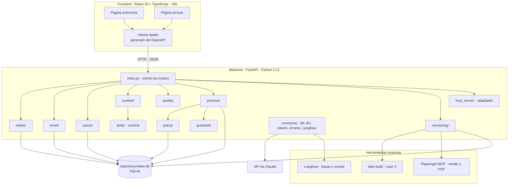
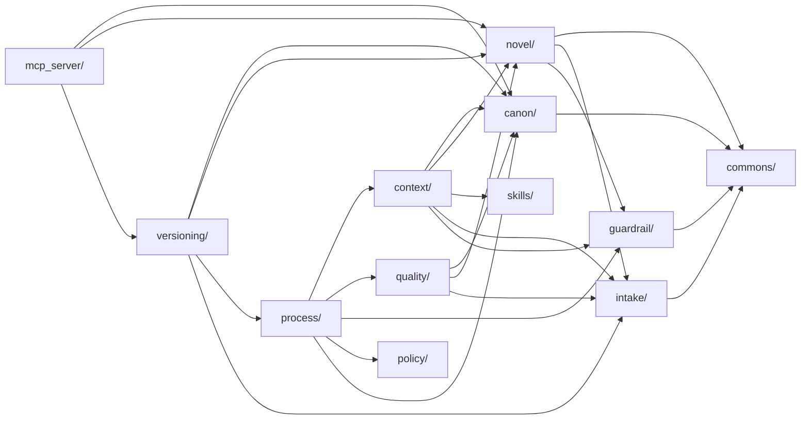
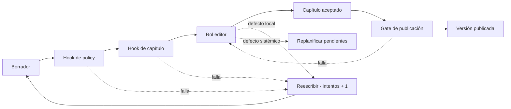
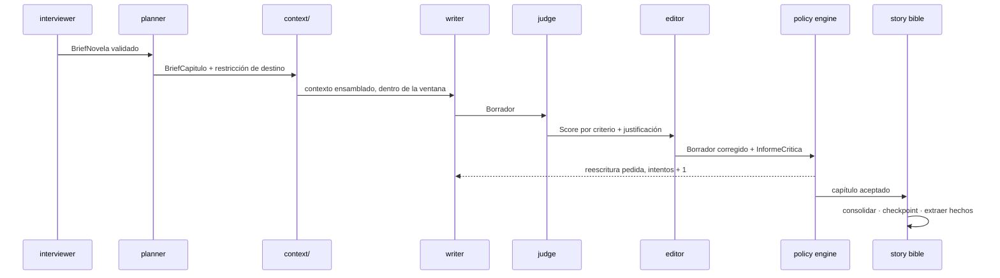
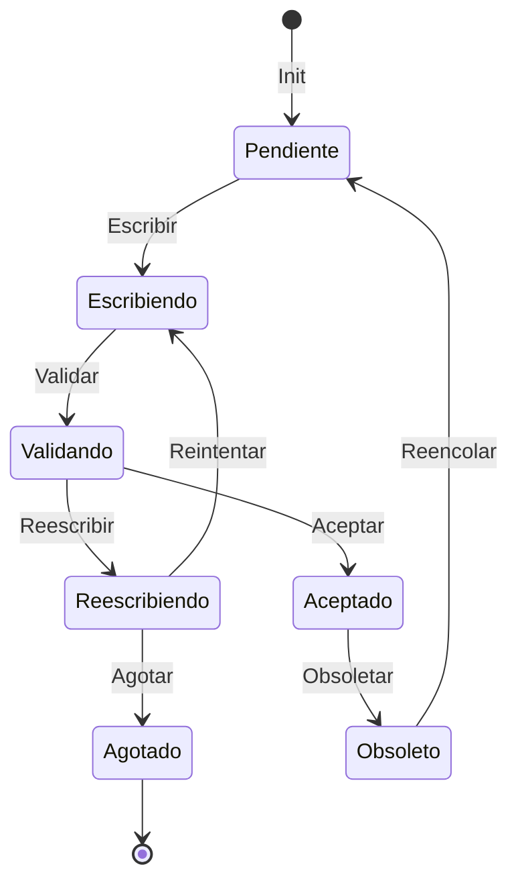
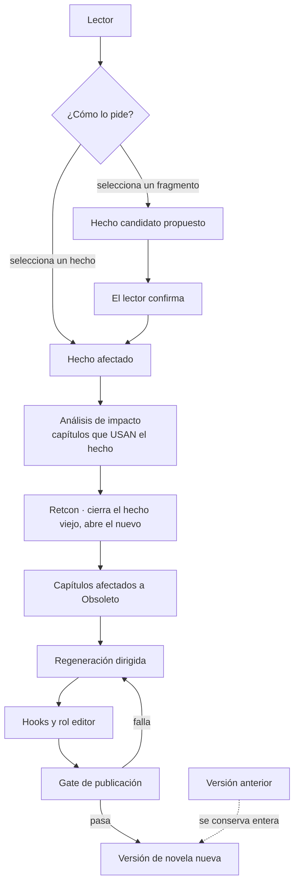
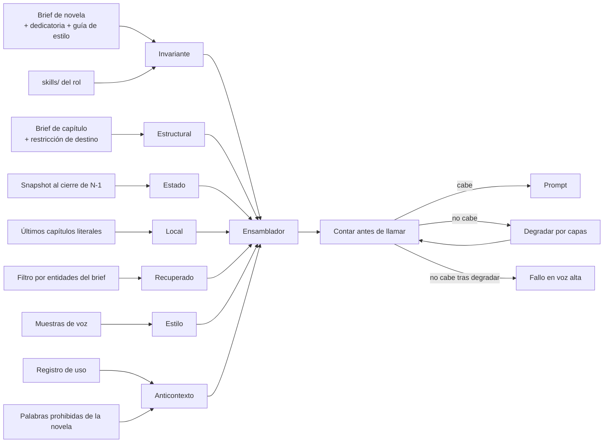
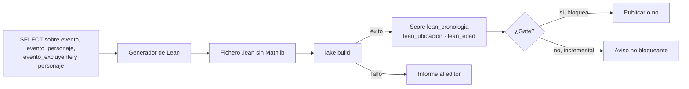
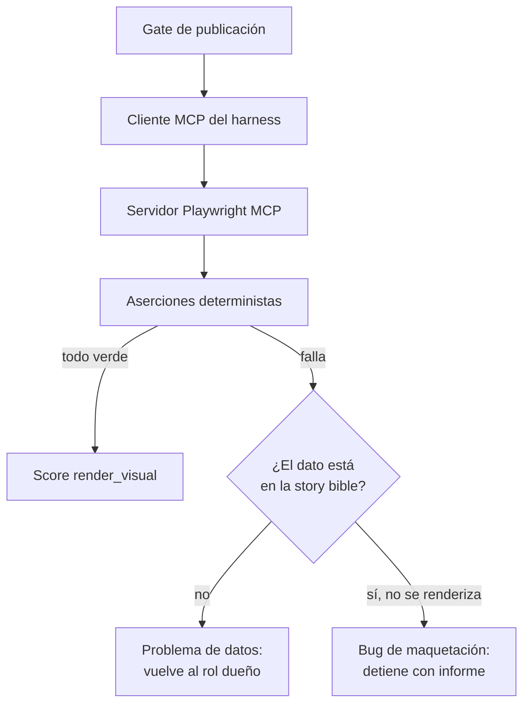

# Arquitectura — sistema, agentes y proceso

Cómo se implementa la ontología: qué piezas corren, qué agente hace cada cosa y en qué
orden. Es un documento editable en el repositorio.

## Frontera con el contexto semilla

`definitions.md` dice *qué existe* —clases, atributos, relaciones— y `domain-knowledge.md`
*cómo se relaciona* —jerarquías, grafos, máquinas de estado—. Aquí vive lo que no es
ninguna de las dos cosas: el despliegue, los agentes concretos que encarnan los roles, sus
skills y el orden de ejecución. Las reglas cerradas están en `CLAUDE.md`; todas las cifras,
en `config/thresholds.yaml`.

**Nada de `backend/`, `frontend/`, `formal/`, `data/`, `ejemplos/` ni `.claude/agents/`
existe todavía.** El layout los reserva en `CLAUDE.md` y este documento describe su destino,
no su estado: toda ruta bajo esos árboles se lee **▸ prevista** aunque no lo repita cada vez.

**Regla que gobierna este documento: `domain-knowledge.md` dibuja la ontología y este
dibuja la implementación.** Ningún diagrama se repite entre los dos. Donde hace falta el de
ontología, hay enlace y no copia.

| Si buscas | Está en |
| --- | --- |
| Qué es un Hecho, una Promesa, un Elemento personalizado | `definitions.md` |
| Qué aristas unen las entidades, qué estados tiene un capítulo | `domain-knowledge.md` |
| Qué agente escribe el capítulo, con qué modelo y qué skill | este documento |
| Qué valida cada validador, dónde corre y qué pasa si falla | `verification.md` |
| Qué tecnología, qué reglas y qué política de contexto | `CLAUDE.md` |
| Por qué se eligió una opción frente a otras | `trade-offs.md` |
| **Cualquier número** | `config/thresholds.yaml` |
| Identificador y effort de modelo por rol | `config/models.yaml` |

### Cómo usarlo

1. Las clases de dominio se nombran **igual** que en `definitions.md`, viva en la feature
   que viva cada una. Un nombre nuevo en el código sin entrada en la ontología es un error.
2. Las tablas y sus claves foráneas siguen «Relaciones del dominio», cardinalidades
   incluidas.
3. Las máquinas de estado de `domain-knowledge.md` se implementan tal cual. Ninguna
   transición extra sin actualizar antes el diagrama y la tabla de transiciones de § Proceso.
4. Antes de cerrar una tarea de dominio, comprueba que las preguntas de competencia
   afectadas siguen respondiéndose.

---

## Visión del sistema

Dos procesos propios, un fichero de base de datos y tres herramientas externas que no son
servidores nuestros: Langfuse para observabilidad, la toolchain de Lean para la
verificación de la historia y un servidor Playwright MCP para la validación visual y el
export. TLC corre en desarrollo, nunca en una generación.



**Reparto de responsabilidades.** El frontend no decide nada de la story bible: muestra,
recoge el brief y recoge peticiones de cambio. Toda regla de dominio se resuelve en el
backend. El cliente tipado de `frontend/src/shared/api/` ▸ previsto se deriva del OpenAPI de FastAPI,
de modo que el contrato se escribe una sola vez.

**El orquestador es código propio** (`trade-offs.md` TO-012): una máquina de estados en
`process/` que lee el estado del capítulo y decide qué rol corre a continuación. No hay
agentes autónomos que conversen entre sí, y ningún agente elige el paso siguiente. El
motivo no es estético: la especificación TLA+ del alcance solo puede corresponderse con el
código si la máquina de estados es nuestra.

---

## Anatomía de una feature

El backend se organiza por features, no por capas técnicas. Cada carpeta es una rodaja
vertical con la misma anatomía:

```
canon/
  router.py       # endpoints FastAPI de esta feature y nada más
  schemas.py      # Pydantic de entrada y salida
  models.py       # entidades de la ontología que le pertenecen
  service.py      # lógica: es donde vive la regla de dominio
  repository.py   # SQL explícito contra SQLite
```

| Feature | Capa | Es dueña de |
| --- | --- | --- |
| `intake/` | 1A — Encargo | Comprador, Destinatario, Ocasión, Brief de novela, Elemento personalizado, Texto libre aportado, Fragmento sospechoso, Dato faltante, Contradicción de brief, Dedicatoria |
| `novel/` | 1B — Obra | Obra, Capítulo, Personaje, Lugar, Arco, Hilo de trama, Evento, Evento excluyente, Regla del mundo, Voz narrativa |
| `canon/` | 2 — Canon | Hecho, Estado de hecho, Uso de hecho, Snapshot, Promesa narrativa, Estado de promesa, Contradicción de canon, Retcon |
| `context/` | 3 — Contexto | Brief de capítulo, Resumen de capítulo, Jerarquía de compresión, Política de recuperación, Anticontexto, Ventana efectiva, y los tres tipos de memoria como lectura |
| `quality/` | 4 — Calidad | Dimensión de calidad, Validador, Defecto, Informe de crítica, Rúbrica, Revisor humano, Defecto inyectado, Brief de prueba |
| `guardrail/` | 4 — Calidad | Palabra prohibida, Nivel de palabra prohibida, Normalización, Coincidencia, Límite de reescrituras |
| `process/` | 5 — Proceso | Esquema, Restricción de destino, Borrador, Extracción, Invalidación de restricción, Replanificación de capítulos pendientes, Checkpoint |
| `policy/` | 5 — Proceso | Policy engine, Decisión de policy, Audit log |
| `versioning/` | 5 — Proceso | Versión de novela, Solicitud de cambio, Análisis de impacto, Regeneración dirigida, Lector |

La tabla es exhaustiva sobre las clases de `definitions.md`. Si una clase de la ontología no
aparece aquí, es un hueco de este documento, no una clase sin dueña.

**Tres excepciones declaradas, y se declaran para que la regla no se erosione por costumbre.**
`mcp_server/`, `skills/` y `prompts/` viven junto a las features y **no son features**: no
tienen `models.py` ni `repository.py` y no son dueñas de ninguna clase. El primero expone por
otro protocolo lo que los `service.py` ya resuelven; el segundo es contenido que los roles
cargan; el tercero guarda **un prompt por rol** y el comando `sync` que los publica en
Langfuse (TO-024), porque los prompts son memoria procedural que se versiona con git y no
pertenecen a una sola feature (TO-036, D-09, aceptada por el desarrollador). Cualquier
carpeta nueva que quiera esta excepción tiene que justificarla aquí.

**Tres clases que no son tabla de nadie.** Las tres memorias —episódica, semántica,
procedural— son la lectura por tipo de lo que ya está en `data/storymaker.db` y en el repo
(ver § Memoria); `Ventana efectiva` es una propiedad medida del modelo, no un dato que se
persista; y `Sesión`, `Traza`, `Span`, `Score` y `Versión de prompt` viven en Langfuse.

**Qué entra en `commons/`.** Solo infraestructura que usan dos o más features: conexión y
migraciones de SQLite, cliente del modelo con su timeout, contador de tokens, cliente de
Langfuse, excepciones de dominio y su handler HTTP central. Ninguna clase de la ontología
vive ahí.

**Regla de importación.** Una feature importa de `commons/` y del `service.py` de otra,
**nunca de su `repository.py`**, y sin ciclos.



`process/` es la única que depende de casi todas, y es correcto: es el orquestador. Nadie
depende de `process/` salvo `versioning/`, que necesita encolar una regeneración.

**Las seis aristas hacia `intake/` y `guardrail/`** salieron del plan 1 (TO-036, D-08,
aceptada por el desarrollador): `novel/` sirve `/novelas` y guarda el brief y las palabras
de nivel `novela`; `context/` necesita el brief para la capa Invariante y las palabras
vetadas para el Anticontexto; `quality/`, el brief y el texto libre para
`invencion_destinatario`; `versioning/`, la dedicatoria para la portada. **No pueden crear
un ciclo mientras `intake/` y `guardrail/` solo importen de `commons/`**, y eso es lo que
comprueba la prueba de importaciones del plan.

---

## Agentes

Cada agente encarna un rol de la Capa 5 de `definitions.md`. Los nombres de rol son
ontología; los de agente e identificadores de modelo son implementación.

**El identificador y el effort de cada rol viven en `config/models.yaml`**, no
escritos en este documento. La tabla nombra la clave, no el valor.

| Agente | Rol | Entrada → salida | Tools | Skills | Clave en `config/models.yaml` | Span |
| --- | --- | --- | --- | --- | --- | --- |
| `interviewer` | Entrevistador | Formulario y texto libre → `BriefNovela` | `extraer_hechos_texto_libre`, `detectar_contradiccion` | — | `roles.entrevistador` | `interviewer` |
| `planner` | Planificador | `BriefNovela` → `Esquema` con una `RestriccionDestino` por capítulo | `consultar_story_bible` | `personalizacion-natural` | `roles.planificador` | `planner` |
| `writer` | Redactor | `BriefCapitulo` + contexto → `Borrador` | `consultar_story_bible` | `personalizacion-natural` | `roles.redactor` | `writer` |
| `judge` | Editor / Crítico, mitad que **puntúa** | `Borrador` → `Score` por criterio de la `Rúbrica`, con justificación | — | — | `roles.judge` | `judge` |
| `editor` | Editor / Crítico, mitad que **corrige** | `Borrador` + `InformeCritica` → `Borrador` corregido | `consultar_story_bible` | `personalizacion-natural` | `roles.editor` | `editor` |
| `extractor` | Extractor | Capítulo aceptado → `Hecho` en estado `propuesto` | `consultar_story_bible` | — | `roles.extractor` | `extractor` |

**Todo esquema de entrada y salida es Pydantic, y toda tool lleva `strict: true`**, que es
lo que da el «schema validado» que el alcance exige. Una salida que no valida es un fallo
del validador `schema_valido` en el hook de policy, no una excepción que se traga nadie.

**El judge se separa del editor, y no es cosmética** (TO-013). Puntuar y corregir son dos
operaciones y solo la primera arrastra sesgo de autopreferencia: si quien puntúa es el mismo
modelo que escribió, el sistema converge hacia lo que a ese modelo le gusta. La corrección
no lo arrastra porque su salida vuelve a pasar por los validadores. **Punto ciego declarado**:
el judge corre en un modelo menos capaz que el redactor, y lo único que mide esa brecha es
la comparación con el `Revisor humano`.

**Política de reintentos, la misma para todos**: un solo contador acumulativo por capítulo
(`orquestacion.max_intentos_capitulo`), con el guardrail como sublímite de coincidencias
consecutivas (`guardrail.max_reescrituras`). Los fallos de infraestructura tienen su propio
contador (`orquestacion.max_intentos_trabajo`) y **no gastan** del primero: que el proveedor
devuelva un 429 no es un defecto del capítulo. Las llamadas al modelo son asíncronas y con
timeout explícito.

**Ningún agente escribe en la story bible directamente.** Solo `canon/` lo hace, y solo al
consolidar un capítulo aceptado.

---

## Skills

Dos bloques que no se mezclan: uno corre en producción y el otro no corre nunca.

### Runtime — `backend/app/skills/` ▸ previsto

Contenido en formato Agent Skill que el ensamblador inyecta en la capa Invariante del
prompt. Se empaqueta y se instala con el backend.

| Skill | Qué enseña | La cargan | Validador que mide si sirvió |
| --- | --- | --- | --- |
| `personalizacion-natural` | Qué distingue un elemento tejido de uno insertado, cómo repartirlos entre capítulos y las tres formas reconocibles de personalización forzada | `planner`, `writer`, `editor` | `personalizacion_natural` |

Es **la skill reutilizable que exige el alcance §3**. Comparte nombre con el score que la
mide, por la regla «un concepto, un nombre en cada ámbito»: es lo que permite leer un eval y
saber qué fichero tocar.

**No contiene datos de ninguna novela.** Los elementos concretos los trae
`consultar_story_bible`; la skill trae el método. Y **no contiene la rúbrica**: la escala,
las anclas y los pesos viven solo en el prompt del `judge`, para que el `writer` no optimice
contra el criterio con el que se le va a puntuar. **Punto ciego declarado**: la frontera
entre método y rúbrica no es nítida, ninguna ancla numérica puede aparecer en la skill, y
nada detecta esa deriva salvo leer la skill.

### Desarrollo — `.claude/skills/`

Documentación que un agente carga al escribir código. Ninguna corre en el harness. Origen y
hash en `skills-lock.json`.

| Skill | Origen | Se carga cuando |
| --- | --- | --- |
| `backend-feature-slice` | Escrita aquí | Hay que colocar un archivo Python, añadir un endpoint, decidir de qué feature es una clase o resolver una importación |
| `feature-sliced-design` | [`feature-sliced/skills`](https://github.com/feature-sliced/skills) | Hay que colocar un archivo del frontend, definir la API pública de un slice o resolver un cross-import |
| `sqlite-relacional` | Escrita aquí | Se crea o cambia una tabla, se escribe una migración o cualquier SQL, se abre una transacción |
| `sqlite-vec` | Vendorizada desde `existential-birds/beagle` | Solo si se reactiva la búsqueda vectorial, que **no se usa en v1** (TO-015) |
| `presupuesto-de-contexto` | Escrita aquí | Se ensambla un prompt, se toca el contador de tokens o se decide qué comprimir |
| `plan-de-verificacion` | Escrita aquí | Se construye o revisa el plan de verificación, o se clasifica una afirmación T/A/I/D/U |
| `grill-me` | [`mattpocock/skills`](https://github.com/mattpocock/skills) | Se quiere someter a interrogatorio un plan o un diseño. Es un shim que invoca a `grilling` |
| `grilling` | [`mattpocock/skills`](https://github.com/mattpocock/skills) | Cerrar decisiones abiertas antes de escribir: recorre el árbol de decisiones por rondas y no deja ninguna rama sin visitar. Este documento salió de una sesión suya |

Instalación y actualización de las de origen externo con `npx skills add <url> --skill
<nombre> --agent claude-code --copy`. El flag `--copy` es deliberado: sin él la CLI deja un
symlink que en Windows se commitea como fichero de texto.

### Precedencia

Una skill es referencia, no autoridad. Si lo que propone choca con `CLAUDE.md` o con el
contexto semilla, manda el repositorio. Dos casos que ya sabemos que chocan:

- FSD admite `widgets/` y lo desaconseja; aquí directamente no se usa.
- `sqlite-vec` ilustra la integración con embeddings de OpenAI; de la skill se reutilizaría
  el patrón SQL, nunca el proveedor.

---

## Hooks y policy engine

Cuatro puntos de ejecución en orden fijo. Lo barato y determinista corre primero: no tiene
sentido pagar un juicio de modelo sobre un capítulo que no cumple su schema.



| Punto | Quién lo ejecuta | Qué corre | Coste |
| --- | --- | --- | --- |
| Hook de policy | `policy/` | Conformidad de schema y guardrail de palabras prohibidas | Determinista, sin modelo |
| Hook de capítulo | `quality/` | Los validadores programáticos de continuidad y prosa, **en paralelo** | Determinista, sin modelo |
| Rol editor | `quality/` | El `judge` puntúa la rúbrica; el `editor` corrige | Dos llamadas al modelo |
| Gate de publicación | `versioning/` | Lean, elementos obligatorios, cierre del arco y render visual | Subprocesos, sin modelo |

**El policy engine es lo que sustituyó al autor humano.** Adopta o descarta un `Hecho`
propuesto, acepta o devuelve un capítulo y detiene la generación. Cada decisión deja fila en
el audit log con la regla aplicada, la entrada y el resultado: si nadie puede reconstruir
por qué se adoptó un hecho, la automatización ha sustituido un juicio por un misterio.

**Guardrail.** Tres niveles —`global`, `perfil` y `novela`—, aplicados en conjunto y ganando
el más restrictivo. Toda `Coincidencia` queda en el audit log y en Langfuse.

**La normalización corre antes de comparar**, y se aplica **a los dos lados**: al texto del
capítulo y a la palabra de la lista. Cinco transformaciones, todas activables por separado
en `config/thresholds.yaml` § `guardrail.normalizacion`:

| Transformación | Qué iguala |
| --- | --- |
| Minúsculas | `Idiota` y `idiota` |
| Acentos | `imbécil` y `imbecil`, que es como se escribe cuando se quiere esquivar el filtro |
| Signos | `i-d-i-o-t-a` y los separadores intercalados |
| Plurales | `idiota` e `idiotas` |
| Variantes simples | Diminutivos y aumentativos regulares |

Desactivar una abre un agujero por variante, y el agujero no se ve en los tests que alguien
escribió pensando en la forma canónica: por eso las cinco tienen valor por defecto `true` y
apagarlas es una decisión explícita. Dos pasadas consecutivas sin limpiar el texto detienen
la generación e informan, sin esperar al tercer intento: un modelo que no quita una palabra
en dos pasadas no la va a quitar en la tercera.

---

## Proceso de producción

### Ciclo



### Estados y la tabla que exige el README

Los estados son exactamente los de `domain-knowledge.md`, que los dibuja como ontología.
Aquí van **anotados con el nombre de la acción TLA+** que los recorre, que es lo que este
documento añade y aquel no tiene:



La máquina de estados del orquestador **es una tabla declarativa** `(estado, condición) →
estado` en `process/`, y el `.tla` declara las mismas acciones; **un test falla si divergen**
(TO-020). La tabla del README se genera desde ese dato, de modo que no puede quedarse vieja
en silencio.

| Acción TLA+ | Máquina | Estado origen | Estado destino | Función de código |
| --- | --- | --- | --- | --- |
| `Init` | Capitulo | — | `Pendiente` | `orquestador.estado_inicial` · normaliza a `Pendiente` el capítulo a medias al reanudar |
| `Escribir` | Capitulo | `Pendiente` | `Escribiendo` | `orquestador.escribir` |
| `Validar` | Capitulo | `Escribiendo` | `Validando` | `orquestador.validar` |
| `Aceptar` | Capitulo | `Validando` | `Aceptado` | `orquestador.aceptar` · única que escribe en la story bible |
| `Reescribir` | Capitulo | `Validando` | `Reescribiendo` | `orquestador.reescribir` · `intentos + 1` |
| `Reintentar` | Capitulo | `Reescribiendo` | `Escribiendo` | `orquestador.reintentar` |
| `Agotar` | Capitulo | `Reescribiendo` | `Agotado` | `orquestador.agotar` |
| `Obsoletar` | Capitulo | `Aceptado` | `Obsoleto` | `orquestador.obsoletar` · lo dispara el retcon |
| `Reencolar` | Capitulo | `Obsoleto` | `Pendiente` | `orquestador.reencolar` |
| `Planificar` | Novela | `Configurando` | `Planificando` | `orquestador.planificar` |
| `FijarEsquema` | Novela | `Planificando` | `Escribiendo` | `orquestador.fijar_esquema` |
| `CerrarEscritura` | Novela | `Escribiendo` | `Validando` | `orquestador.cerrar_escritura` · todos los capítulos aceptados |
| `DevolverAlEditor` | Novela | `Validando` | `Escribiendo` | `orquestador.devolver_al_editor` · falla el gate |
| `Publicar` | Novela | `Validando` | `Publicando` | `orquestador.publicar` · exige el gate en verde |
| `Conservar` | Novela | `Publicando` | `Publicada` | `orquestador.conservar` · versión inmutable escrita |
| `Regenerar` | Novela | `Publicada` | `Regenerando` | `orquestador.regenerar` · solicitud de cambio confirmada |
| `CerrarRegeneracion` | Novela | `Regenerando` | `Validando` | `orquestador.cerrar_regeneracion` · afectados reescritos |
| `Detener` | Novela | `Escribiendo` | `Detenida` | `orquestador.detener` · terminal |

`Escribiendo` y `Validando` existen en las dos máquinas con sentidos distintos, y por eso la
tabla dice de qué máquina es cada fila. Las seis acciones de la novela que el diagrama de
`domain-knowledge.md` dibujaba sin nombre —de `FijarEsquema` a `CerrarRegeneracion`— se
nombraron al implementar la tabla del orquestador (plan 1, P13; TO-039), y la prueba de
`process/` compara esta tabla y los dos diagramas con el dato del código.

### Checkpoint y reanudación

El `Checkpoint` es el último capítulo completado. **La reanudación no es una transición**
(TO-023): una caída de infraestructura no lleva a `Detenida` —que es el fin deliberado tras
agotar intentos—, sino que hace desaparecer el proceso en mitad de `Escribiendo`. Por eso la
reanudación se modela en el predicado `Init`: capítulos `1..k` en `Aceptado`, checkpoint en
`k`, y el capítulo `k+1` normalizado a `Pendiente`. La función que lo implementa es
`orquestador.estado_inicial`, primera fila de la tabla de arriba.

Las dos mitades de la invariante «no duplica ni pierde capítulos»: el conjunto de aceptados
es siempre un **prefijo contiguo**, y **la aceptación de un capítulo ocurre a lo sumo una vez
por versión**. No se formula sobre la escritura del texto: los reintentos producen varios
borradores en la misma versión, y eso es correcto.

### Regeneración dirigida



**La selección de fragmento nunca regenera sola** (TO-011): propone un hecho candidato y el
lector confirma. El `Análisis de impacto` se calcula sobre la relación `usa`, no sobre
`establece`: un hecho establecido en el capítulo 2 y mencionado en el 7 obliga a reescribir
los dos.

### Paralelo y serie

| Modo | Quién | Por qué |
| --- | --- | --- |
| Serie, por novela | Los capítulos, uno tras otro | El contexto del capítulo N incluye el snapshot al cierre de N−1: generarlos en paralelo es semánticamente imposible, no solo caro |
| Serie, por capítulo | `writer` → `judge` → `editor` | Cada uno consume la salida del anterior |
| Paralelo, sin pool | Los validadores programáticos del hook de capítulo | No llaman al modelo |
| Serie, global | La consolidación en `canon/` | Una transacción de escritura a la vez; `WAL` deja leer en paralelo |

---

## Validadores

**La tabla vive en `docs/verification.md`** (TO-018), con nombre, tipo, punto de ejecución,
score y qué pasa si falla. Aquí solo el mapa de dónde corre cada familia; duplicar la tabla
crearía una tercera copia y una de las tres se quedaría vieja.

`definitions.md` Capa 4 define **qué mide** cada dimensión; `verification.md`, **cómo se
comprueba y qué pasa si falla**; este documento, **dónde corre**.

```mermaid
flowchart TD
  HP[Hook de policy] --> V1[schema_valido]
  HP --> V2[palabras_prohibidas]
  HC[Hook de capítulo] --> V3[nombres_exactos]
  HC --> V4[longitud]
  HC --> V5[consistencia_factica]
  HC --> V6[calidad_prosa]
  HC --> V7[integridad_pov]
  HC --> V8[cumplimiento_brief]
  HC --> V21[reglas_mundo]
  ED[Rol editor] --> V9[personalizacion_natural]
  ED --> V10[reconocibilidad]
  ED --> V11[adecuacion_tono]
  ED --> V12[coherencia_personajes]
  ED --> V13[ritmo]
  ED --> V22[invencion_destinatario]
  ED --> V23[temas_excluidos]
  ED --> V24[legibilidad]
  GT[Gate de publicación] --> V14[lean_cronologia]
  GT --> V15[lean_ubicacion]
  GT --> V16[lean_edad]
  GT --> V17[elementos_obligatorios]
  GT --> V18[cierre_arco]
  GT --> V19[render_visual]
  GT --> V25[estructura_edicion]
  GT --> V26[regeneracion_fiel]
  EXP[Export a PDF] --> V20[paridad_pdf_web]
```



**`paridad_pdf_web` y el punto de ejecución `export` son nuevos y no están en la ontología.**
Van en la lista de cambios pendientes de `definitions.md`: añadir una fila a la Capa 4 y un
quinto punto de ejecución es un cambio de ontología con su entrada en el registro de
iteraciones, y no se hace de tapadillo desde aquí.

---

## Ensamblado de contexto

La política está en `CLAUDE.md` § Presupuesto de contexto. Aquí, cómo se implementa.



**La capa Invariante se compone por rol** (TO-021). `planner`, `writer` y `editor` cargan
`personalizacion-natural` en su Invariante; `interviewer`, `judge` y `extractor` no. La
consecuencia práctica hay que decirla en voz alta: **los tres roles que cargan la skill
tienen menos sitio** en su Invariante para premisa, brief y guía de estilo que los que no la
cargan, y su presupuesto se mide por rol, no una vez para todos.

**El recuento usa `messages.count_tokens` del proveedor, nunca una estimación por
caracteres.** El contador propio y el del proveedor tienen que coincidir, y la diferencia,
si la hay, cabe en el margen. Se cuenta **antes** de llamar: contar después es descubrir el
problema cuando ya has pagado la llamada.

**Degradación**: Recuperado → Estilo → Local → Estado, parando en cuanto quepa. La capa
Invariante y la restricción de destino **no se degradan nunca**. Comprimir es bajar de
resolución —sustituir un capítulo literal por su resumen— antes que eliminar nada.

**Recuperado sin `sqlite-vec` en v1** (TO-015). La novela entera cabe en el presupuesto de
la capa, así que no hace falta un índice vectorial para elegir qué traer. **Caber no es
enviar**: la capa sigue filtrando por las entidades del brief de capítulo, porque mandar la
novela entera en cada llamada chocaría con el tope concurrente.

---

## Presupuesto de tokens concurrentes

Dos topes que se confunden a menudo, y ninguna cifra en esta sección: todas en
`config/thresholds.yaml`.

| | `contexto.total` | `en_vuelo.total` |
| --- | --- | --- |
| Qué limita | **Una** petición | **Cuántas** caben a la vez |
| Quién lo fija | Nosotros | Nosotros |
| De dónde sale | Decisión de diseño | Alcance §7, «máximo de tokens concurrentes» |
| Alcance | Un prompt | Toda la instancia |

**Ninguno de los dos es la ventana del proveedor.** Los modelos elegidos tienen ventanas
muy superiores; estos topes son nuestros. El comentario de `config/thresholds.yaml` que
atribuye el primero al proveedor es una corrección pendiente.

**Estimación antes de encolar.** La estimación de un trabajo es el tamaño de su contexto
ensamblado, que **ya incluye** `contexto.capas.margen` como reserva de respuesta: la salida
no se suma dos veces.

**El margen tiene que cubrir la salida, y eso se comprueba.** Con thinking adaptativo los
tokens de razonamiento cuentan **dentro** de `max_tokens`, así que el margen solo cubre la
respuesta si `contexto.capas.margen ≥ max_tokens` **de cada rol**. El arranque comprueba esa
desigualdad rol por rol y **falla en voz alta** si no se cumple: un margen corto no produce
un error claro, produce respuestas truncadas a mitad de capítulo que parecen un problema de
calidad. Va también a `verification.md` como validador candidato, programático y de arranque.

**El pool es un guardarraíl, no un planificador.** Es un semáforo en proceso, **compartido
entre todas las novelas de la instancia**, con admisión **FIFO estricta**: nadie adelanta a
nadie, aunque quepa. Es más lento en conjunto que dejar colarse a los pequeños, y a cambio
el `writer` —que es quien pide más ventana— no se queda esperando detrás de una fila de
llamadas cortas que nunca deja hueco suficiente.

**Un trabajo cuya estimación supera `en_vuelo.total` falla al encolarse.** Esperar un hueco
que no va a existir nunca no es esperar, es colgarse.

**Qué corre a la vez**: entre novelas, lo que la admisión FIFO permita; dentro de una novela,
los capítulos van en serie y los validadores programáticos del hook en paralelo y **fuera
del pool**, porque no llaman al modelo. Backoff exponencial con jitter ante límites de tasa;
agotados los intentos de trabajo, escala.

---

## Memoria a corto y largo plazo

Dos memorias con vidas distintas. Confundirlas es lo que hace que un borrador rechazado
contamine el estado del mundo.

### Corto plazo

| Pieza | Quién la escribe | Cuánto dura | Dónde vive |
| --- | --- | --- | --- |
| Contexto ensamblado por capas | `context/` | Una llamada | Memoria del proceso |
| Capítulos literales de la capa Local | `context/`, leídos de `novel/` | Una llamada | Memoria del proceso |
| Borradores y reintentos de un capítulo | `process/` | Hasta aceptar o agotar | Memoria del proceso |
| Informe de crítica del intento | `quality/` | Hasta aceptar | Memoria del proceso |
| **Diálogo en curso del Entrevistador** | `intake/` | Hasta validar el brief | **SQLite**, con `novel_id` |

**El diálogo de la entrevista es corto plazo persistido**, y es la única pieza de corto plazo
que toca disco. El motivo es que ocupa varias peticiones HTTP y forma parte de la sesión de
Langfuse de la novela: no puede vivir en memoria de un trabajo que termina con cada
respuesta. Consecuencias: lleva `novel_id` como cualquier tabla de dominio; **el texto libre
aportado se guarda marcado como no confiable** y nunca se reinyecta como instrucción; y al
validar el brief se conservan el texto libre y los `Fragmento sospechoso` detectados
—porque son la evidencia de qué se descartó y por qué, y la pregunta de competencia 4 los
consulta— mientras que los turnos intermedios del diálogo se descartan.

### Largo plazo, en `data/storymaker.db` ▸ previsto

| Pieza | Quién la escribe | Cuándo |
| --- | --- | --- |
| Brief de novela y sus elementos | `intake/` | Al validar contra el schema |
| Story bible: hechos, uso, snapshots, promesas, eventos | `canon/` | Al consolidar |
| Capítulos aceptados, texto literal | `novel/` | Al consolidar |
| Resúmenes por capítulo | `context/` | Al consolidar |
| Checkpoint | `process/` | Al consolidar |
| Versión de novela y su vínculo con los capítulos | `versioning/` | Al publicar |
| Audit log | `policy/` | En cada decisión del policy engine |

**Punto único de promoción.** Lo de corto plazo pasa a largo **al consolidar un capítulo
aceptado, y solo ahí**. Un borrador rechazado se descarta entero: no deja hechos, ni
resumen, ni muestras de voz. Si hubiera un segundo punto, cada iteración fallida dejaría
sedimento y la story bible acabaría siendo el registro de lo que el sistema intentó, no de
lo que la novela dice.

**Compresión.** Tres niveles —resumen de obra, resumen de capítulo, capítulo literal—. Lo
lejano entra comprimido y lo cercano literal, y el estado se pasa siempre como `Snapshot`
derivado, nunca como el texto completo de lo anterior.

**Qué sobrevive a una regeneración: todo.** Una regeneración **no borra nada**. La versión
nueva sustituye a la anterior como versión vigente, y **la anterior queda consultable
entera**: su texto, sus capítulos y **sus hechos**, porque el retcon no sobrescribe la story
bible en su sitio (§ Story bible, versionado por vigencia). Los capítulos que el retcon marca
`Obsoleto` lo quedan **para la versión nueva**, no para la anterior.

**Aislamiento.** Toda tabla de dominio lleva `novel_id`. En corto plazo el aislamiento es por
construcción, porque un trabajo pertenece a una novela; la excepción persistida —el diálogo
de la entrevista— lo lleva explícito.

### Mapeo a los tres tipos de la ontología

| Tipo | Qué lo encarna | Dónde |
| --- | --- | --- |
| **Episódica** | Capítulos aceptados en su forma literal y sus resúmenes | SQLite |
| **Semántica** | Story bible: hechos, snapshots, promesas, cronología, reglas del mundo. Y el brief | SQLite |
| **Procedural** | La `Voz narrativa`, la guía de estilo, **los prompts de cada rol** y la skill `personalizacion-natural` | **El repositorio, no SQLite** |

**La memoria procedural vive en el repositorio**, y eso tiene tres consecuencias que la
distinguen de las otras dos: se versiona con **git**, pasa por el ciclo de cambio del
repositorio como cualquier otro fichero, y entra en la **`Versión de prompt`** de Langfuse,
de modo que un cambio en un prompt, en la guía de estilo o en la skill es **atribuible** en
los evals. Ninguna de las tres cosas es cierta de la memoria episódica ni de la semántica.

**Las trazas de Langfuse son observabilidad, no memoria.** Nada del sistema las lee para
generar: un prompt nunca contiene una traza. Importa decirlo porque el día que algo las
leyera pasarían a ser memoria, y entonces necesitarían la disciplina de `novel_id` y de
retención que hoy no tienen.

---

## Story bible

El esquema conceptual está en `domain-knowledge.md` § Story bible. Aquí vive la
materialización: qué tabla corresponde a cada clase, cómo se versiona y qué índices la
sostienen. **`StoryBible` no es una tabla**: es la vista consolidada sobre las de `canon/` y
`novel/` que los roles consultan.

### Clase a tabla

Derivable sin decidir nada: el SQL sale de aquí. **Toda tabla de dominio lleva `novel_id`**
desde la primera migración —una instancia aloja varias novelas y ninguna consulta de dominio
es correcta sin acotar a una—, y ninguna lleva `user_id` ni `tenant_id`.

| Clase | Tabla | Notas |
| --- | --- | --- |
| Comprador | `comprador` | |
| Destinatario | `destinatario` | |
| Ocasión | `ocasion` | |
| Brief de novela | `brief_novela` | `schema_version` guarda con qué se validó |
| Elemento personalizado | `elemento_personalizado` | `obligatorio` booleano |
| Elemento personalizado ↔ Capítulo | `elemento_capitulo` | puente; sostiene `elementos_obligatorios` |
| Texto libre aportado | `texto_libre` | `estado_saneamiento` |
| Fragmento sospechoso | `fragmento_sospechoso` | |
| Dato faltante | `dato_faltante` | |
| Contradicción de brief | `contradiccion_brief` | |
| Dedicatoria | `dedicatoria` | |
| Obra | `obra` | |
| Capítulo | `capitulo` | `estado`, `intentos`, `palabras` |
| Personaje | `personaje` | `fecha_nacimiento` y `es_destinatario`; entra en Lean |
| Lugar | `lugar` | entra en Lean |
| Arco | `arco` | |
| Hilo de trama | `hilo_trama` | |
| Evento | `evento` | `momento`, `lugar_id`; es la tabla de cronología |
| Evento ↔ Personaje | `evento_personaje` | personajes presentes; entra en Lean |
| Evento ↔ Capítulo | `evento_capitulo` | fábula ↔ discurso, N:M |
| Evento excluyente | `evento_excluyente` | referencia a `evento`; entra en Lean |
| Regla del mundo | `regla_mundo` | |
| Voz narrativa | `voz_narrativa` | |
| Hecho | `hecho` | `estado`, `origen`, `fragmento_soporte`, `alcance_temporal` |
| Uso de hecho | `hecho_capitulo` | puente N:M; sostiene el análisis de impacto |
| Snapshot | `snapshot` | derivado, uno por capítulo |
| Promesa narrativa | `promesa` | `estado`, `capitulo_apertura`, `capitulo_pago` |
| Contradicción de canon | `contradiccion_canon` | |
| Retcon | `retcon` | |
| Restricción de destino | `restriccion_destino` | |
| Brief de capítulo | `brief_capitulo` | |
| Resumen de capítulo | `resumen_capitulo` | |
| Borrador | `borrador` | |
| Informe de crítica | `informe_critica` | |
| Defecto | `defecto` | `clasificacion` local o sistémico |
| Palabra prohibida | `palabra_prohibida` | `nivel` en los tres valores |
| Coincidencia | `coincidencia` | |
| Validador | `validador` | `tipo`, `punto_ejecucion`, `score_langfuse` |
| Score | `score` | valor por validador y traza |
| Versión de novela | `version_novela` | `version_anterior_id` |
| Versión ↔ Capítulo | `version_capitulo` | `modificado` booleano: la marca de capítulo cambiado |
| Solicitud de cambio | `solicitud_cambio` | `origen`: capítulo o fragmento desde el que se pidió |
| Análisis de impacto | `analisis_impacto` | |
| Checkpoint | `checkpoint` | último capítulo completado |
| Decisión de policy | `audit_log` | |

Los fragmentos vectorizados para la capa Recuperado vivirían en su tabla de embeddings, fuera
de esta lista: no son dominio, son índice. En v1 no existen (TO-015).

### Versionado por vigencia

Un retcon **no sobrescribe un hecho en su sitio**. `Hecho` lleva `version_desde` y
`version_hasta`: el retcon cierra el viejo poniéndole `version_hasta` y abre el nuevo con
`version_desde`. Lo mismo vale para el puente `hecho_capitulo`, que es lo que sostiene el
análisis de impacto.

Sin esto se rompen tres cosas a la vez: Lean no se puede volver a ejecutar sobre una versión
anterior porque su cronología ya no existe, `query_story_bible` no puede responder por
versión, y la marca de capítulos modificados pierde la referencia contra la que comparar.

**La trampa, y su guardarraíl.** Una consulta que olvide la versión devuelve «lo vigente» en
silencio, que es el mismo fallo silencioso que olvidar `novel_id`. Por eso **`novel_id` y
`version` son parámetros obligatorios de toda consulta de dominio**, sin valor por defecto,
y eso es comprobable: va a `verification.md` como validador candidato junto al de `novel_id`.

**El uso también se versiona, y no es lo mismo que versionar el hecho.** `hecho_capitulo`
lleva su propio `version_desde` y `version_hasta` porque un capítulo puede dejar de mencionar
un hecho al regenerarse sin que el hecho cambie. Si el puente no se versiona, «qué capítulos
usaban este hecho en la versión 2» devuelve los de la versión vigente, y el análisis de
impacto responde por la versión equivocada. **Invariante de esquema**: la vigencia de una
fila de `hecho_capitulo` está contenida en la de su `hecho`.

### Índices

El índice que decide el rendimiento del sistema es el del análisis de impacto: «qué
capítulos usan este hecho» se ejecuta en cada solicitud de cambio.

| Índice | Sobre | Para qué |
| --- | --- | --- |
| `(novel_id, hecho_id, version_desde, version_hasta)` | `hecho_capitulo` | **Capítulos que usan un hecho**, por versión |
| `(novel_id, capitulo_id)` | `hecho_capitulo` | El camino inverso: hechos que usa un capítulo, para ensamblar contexto |
| `(novel_id, version)` | `version_capitulo` | Qué capítulos cambiaron entre dos versiones |
| `(novel_id, momento)` | `evento` | Orden cronológico para generar el fichero Lean |
| `(novel_id, personaje_id)` | `evento_personaje` | Personajes presentes en cada evento |
| `(novel_id, estado)` | `promesa` | Promesas pendientes al cerrar |

Migraciones numeradas en `backend/app/commons/db/migrations/` ▸ previsto, aplicadas en orden y **nunca
editadas** una vez commiteadas. `WAL` activado. Toda escritura a la story bible va en
transacción y es idempotente por `novel_id` + `chapter_id` + `version`.

---

## Verificación formal

Dos verificaciones con objetos distintos que no se sustituyen: **Lean verifica la historia,
TLA+ verifica el harness**. Una novela puede tener una cronología impecable generada por un
harness que publica capítulos sin validar.

### Lean — la historia



**Dos ejecuciones con papeles distintos** (TO-016). En el **gate**, sobre la cronología
completa, y es lo único que bloquea. **Incremental por capítulo**, sobre la cronología hasta
`t`, no bloqueante: emite un `Score` de aviso y entra en el informe de crítica. El motivo del
incremental es que los invariantes son de seguridad —una violación en un prefijo lo es en la
novela entera—, así que detectarla en el capítulo 3 ahorra siete capítulos de trabajo.

**El fichero generado no importa Mathlib.** Es una restricción de diseño del generador, no
una preferencia: es lo que mantiene el build en segundos en vez de minutos, y sin ella el
chequeo incremental no sale a cuenta.

**El timeout está sin fijar y es deliberado.** No hay toolchain Lean en la máquina de
desarrollo, así que el coste está **estimado y no medido**. `formal.lean_timeout_segundos`
se queda en `null` hasta medirlo. Lean es dependencia de **toolchain**, no de Python: se
declara en el README y en CI, no en `pyproject.toml`.

### TLA+ — el harness

Un módulo con las dos máquinas, `Novela` y `Capitulo`, porque la transición
`Escribiendo → Detenida` las acopla. TLC corre **en desarrollo**, nunca en una generación,
sobre el modelo pequeño cuyos tamaños fija `config/thresholds.yaml` § `modelo_formal`.

**Qué se demuestra**: al menos tres invariantes de seguridad —ninguna versión se publica con
un capítulo que no pasó todos los validadores; la reanudación no duplica ni pierde capítulos;
la versión anterior se conserva siempre tras una regeneración— y una de liveness: toda
ejecución termina en `Publicada` o en `Detenida`, nunca en bucle.

**Dos abstracciones declaradas** (TO-023), porque una abstracción declarada es honesta y una
omisión silenciosa no:

1. **El contador de fallos de infraestructura se abstrae.** Un 429 reintentado no mueve
   ningún estado del capítulo; modelarlo multiplicaría el espacio que TLC explora sin añadir
   propiedad que demostrar.
2. **La reanudación se modela en `Init`, no como acción externa.** Con una acción externa, la
   liveness quedaría condicionada a una hipótesis de fairness sobre alguien que la spec no
   modela. Con `Init`, la fairness se declara **solo sobre las acciones internas**.

**Residuo declarado**: ninguna traza individual exhibe caída→reanudación. Se demuestra que
toda reanudación válida es correcta, no que la reanudación ocurra.

**Correspondencia con el código**: la tabla de § Proceso, generada desde la tabla de
transiciones declarativa de `process/`, con un test que falla si el `.tla` y el código
divergen. El `.tla` expone los nombres de acción y sus pares origen → destino de forma
extraíble trivialmente, para que el test no tenga que interpretar TLA+.

**Contraejemplos.** Todo contraejemplo que TLC encuentre se documenta en
`docs/registro-iteraciones.md` con la propiedad violada, la traza y el cambio que provocó.
Un contraejemplo sin el cambio que produjo es una anécdota.

---

## Observabilidad

La jerarquía está en `domain-knowledge.md` § Observabilidad. Aquí, cómo se instrumenta.

| Concepto | Cómo se materializa |
| --- | --- |
| Sesión | Una por novela: entrevista, generación y todas las regeneraciones |
| Traza | Una por generación, inicial o dirigida |
| Span | Uno por rol y uno por tool, con el nombre de la tabla de § Agentes |
| Score | Uno por validador ejecutado, con **justificación** cuando el validador es semántico |
| Versión de prompt | Nombre y **hash de git** del fichero de prompt realmente usado |

Tokens, coste y latencia se leen de `response.usage` y se acumulan por capítulo y por
novela. El cliente de Langfuse vive en `commons/`, porque lo usan todas las features.

**Versionado de prompts: el repositorio es la fuente** (TO-024). Un comando idempotente
publica cada prompt en Langfuse como versión nueva etiquetada con su hash de git, y cada
generación se vincula a esa versión. Sin red, el backend usa el fichero local. Tres
guardarraíles, y los tres importan:

1. **La sincronización corre en CI y a mano antes de cada eval, nunca al arrancar.** Si
   corriera al arrancar, el arranque volvería a depender de la red.
2. **Es idempotente por hash**: solo publica si ese hash no está ya, o cada ejecución crearía
   una versión idéntica y el historial dejaría de significar nada.
3. **El span registra el hash del fichero realmente usado**, no solo el identificador de
   versión de Langfuse. Si discrepan —sincronización fallida, despliegue a medias— la
   discrepancia es detectable. Sin esto, el sistema puede atribuir un resultado a un prompt
   que no lo produjo, que es justo el fallo que el versionado existe para impedir.

**La ejecución de evals comprueba antes de empezar que el hash de cada prompt existe en
Langfuse, y falla si no.** Sin esa puerta, un eval de tuning local queda mal atribuido.

---

## Lectura web y export

El formato de lectura es **web**, y el PDF es un export de ese mismo render (TO-009).

La página `lectura` sirve índice navegable, ficha de personajes y lugares con enlaces a los
capítulos donde aparece cada uno, portada con la dedicatoria, petición de cambio desde la
propia página y marca de los capítulos modificados respecto a la versión anterior.

### `render_visual` en el gate



**El harness es cliente del servidor Playwright MCP con llamadas guionizadas** (TO-026): es
programático, cuesta cero tokens y usa el browser MCP de forma literal, como pide el alcance
§5a. Un agente LLM navegando queda descartado para el gate porque un juicio de modelo en una
puerta bloqueante significa que una publicación puede fallar por razones que nadie puede
reproducir.

**Aserciones**: el índice tiene una entrada por capítulo y todas resuelven; cada enlace de la
ficha lleva a su capítulo; la portada muestra la dedicatoria; no hay errores de consola ni
desbordes de caja.

**Enrutado del fallo**, determinista y decidido consultando la story bible primero: si el
dato **no está**, es problema de datos y vuelve al rol dueño; si **está y no se renderiza**,
es bug de maquetación y detiene la generación con informe. Un bug de maquetación **no consume
intentos de capítulo**: reintentar no lo arregla, porque el defecto está en el código.

**Residuo declarado**: el vocabulario de aserciones queda acotado por las tools que exponga
el servidor MCP. Cada aserción declara qué tool le da la evidencia, y la que no se pueda
expresar **se declara no cubierta** en vez de debilitarse en silencio.

**Lo que ninguna aserción caza**: un fallo visual que nadie previó —contraste ilegible,
solapamiento en móvil—. Eso lo cubre el uso del browser MCP **en desarrollo**, con Claude
Code contra el mismo servidor, documentado en `docs/browser-mcp.md` ▸ previsto con qué
inspeccionó, qué detectó y qué cambió. No es decoración del entregable: es el complemento
real del punto ciego.

### Export a PDF

Bajo demanda, **una vez por versión**, porque las versiones son inmutables (TO-025). Sale
del mismo render con `page.pdf()` de Playwright (TO-003), de modo que el PDF entregado es lo
que el gate acaba de validar; con otro motor se validaría uno y se entregaría otro. En ese
momento corre `paridad_pdf_web`, que comprueba recuento y títulos de capítulos, presencia de
dedicatoria e índice, y recuento de palabras dentro de tolerancia.
`ejemplos/novela-ejemplo.pdf` ▸ previsto se genera así una vez y se commitea.

---

## Seguridad

| Amenaza | Qué la contiene |
| --- | --- |
| **Inyección por el texto libre** | Entra marcado como datos, nunca en la posición de las instrucciones. Ningún agente ejecuta instrucciones halladas en él. Lo que lo parece se registra como `Fragmento sospechoso` y se descarta. La adopción de un hecho la decide el policy engine, no el texto |
| **Fuga entre novelas** | `novel_id` obligatorio en toda tabla y en toda consulta de dominio, sin valor por defecto |
| **Secretos en el repositorio** | Solo `.env.example`, con los nombres de las variables y ningún valor. `.env` está en `.gitignore` |
| **Exposición en red sin autenticación** | El backend escucha **solo en la interfaz local** mientras no haya autenticación, y se niega a arrancar con un `host` que no lo sea salvo que se pase una opción explícita. El alcance deja las cuentas fuera, así que detrás de la API no hay nada más |
| **Ejecución de lo que devuelve el modelo** | Ningún camino del código ejecuta, evalúa ni lanza como proceso la salida del modelo: es prosa que se guarda |

**Lo que esto no cubre.** El aislamiento por `novel_id` depende de que cada consulta lo lleve,
y eso lo comprueban `A-83` y `A-84` de `verification.md`, que exigen `novel_id` y `version`
como parámetros obligatorios sin valor por defecto. Que el valor pasado sea el correcto no
lo comprueba ninguno de los dos.

**Agente de seguridad** (TO-017). Agente de desarrollo en `.claude/agents/` ▸ previsto, no
runtime. Cubre inyección de prompt sobre el texto libre, exfiltración entre novelas,
dependencias con vulnerabilidades conocidas y secretos en el historial de commits. Su salida
es `docs/security-report.md` ▸ previsto, con cada vulnerabilidad, su severidad y el cambio
que la resolvió.

---

## Opcionales decididos

De los ocho opcionales del alcance se implementan dos (TO-017).

### Servidor MCP de solo lectura

`backend/app/mcp_server/` ▸ previsto, con FastMCP como plugin del FastAPI existente: no añade
infraestructura. Es un **adaptador**, no una feature: no es dueño de ninguna clase y solo
importa `service.py` de otras.

| Tool | Devuelve |
| --- | --- |
| `list_novels` | Novelas con su estado y versión vigente |
| `get_chapter` | Un capítulo de una versión concreta |
| `list_versions` | Historial de versiones y qué capítulos cambiaron en cada una |
| `query_story_bible` | Personajes, lugares, hechos y cronología **de una versión** |
| `download_novel` | La novela completa en PDF |

Cada tool con schema validado, **servidor de solo lectura**, y cada llamada registrada en
Langfuse. Que `query_story_bible` responda por versión es lo que exige el versionado por
vigencia de § Story bible.

### Agente de seguridad

Descrito en § Seguridad.

**Descartados y por qué**: los linters de prosa, porque `calidad_prosa` ya mide lo mismo con
validador propio; el linter de edición manual, porque presupone una edición manual que no
está en el flujo; las tools de escritura sobre MCP, los invariantes Lean adicionales y la
spec TLA+ del MCP, porque profundizan donde ya hay cobertura. El login quedó fuera en TO-004.

---

## Ciclo de cambio del repositorio

El detalle de las tres puertas que fija `CLAUDE.md` § Ciclo de cambio. **No confundir con el
ciclo de producción de la novela**, que es § Proceso de producción: aquel genera capítulos,
este genera código.

### 1. Actualizar la documentación de `docs/`

`/docs` y `config/` son el paso 1 y se actualizan **sin plan aprobado**: la puerta gobierna
el código, no lo que lo especifica. `definitions.md`, `domain-knowledge.md` y este documento
**se editan aquí, en el repositorio**: no hay documento vivo externo ni nada que reexportar
(`trade-offs.md` TO-001).

La regla de los **dos rastros** —`trade-offs.md` y el registro de iteraciones, en el mismo
commit que el cambio— está en `CLAUDE.md` § Contexto semilla, y no se repite aquí. Lo que sí
es de este documento es **qué entra en cada uno**: en `trade-offs.md`, una entrada con
problema, tabla de opciones, criterio, elección y consecuencias, numerada `TO-NNN` y sin
huecos; en el registro, una entrada `RI-NNN` con causa, qué cambió y efecto, que nombra los
ficheros que la materializan. Una decisión sin las dos es una decisión que dentro de un mes
nadie sabrá reconstruir.

### 2. Crear o actualizar una spec

Un fichero por cambio: `specs/specN.md`, numeración correlativa y sin carpetas. Lo obsoleto
se mueve a `docs/specs/_archivo/` con `estado: archivada`, que no es un estado del ciclo
precisamente para que ningún agente lo confunda con trabajo pendiente.

**El interrogatorio previo se hace con la skill `grill-me`**, que recorre el árbol de
decisiones por rondas y no deja rama sin visitar; el catálogo de § Skills dice cuándo
cargarla. Preguntar de una en una deja huecos que solo aparecen al implementar, y una spec
con huecos no pasa a plan.

**La spec nace en `borrador`.** Solo el desarrollador la mueve a `aprobada`; un agente nunca
se aprueba a sí mismo. Contenido mínimo: problema, comportamiento esperado, criterios de
aceptación verificables, fuera de alcance, impacto en ontología, esquema y API, y las
preguntas de competencia afectadas.

### 3. Plan de implementación

`specs/planN.md`. **No se crea si la spec no está `aprobada`**, y se comprueba
leyendo su frontmatter, no de memoria. **Nace en `borrador`** y necesita la aprobación del
desarrollador, igual que la spec. Contenido: pasos ordenados, features y ficheros que se
tocan, migraciones necesarias, **la lista de pruebas que se van a escribir** y en qué orden,
riesgos y criterio de terminado. Un plan que no se puede probar no es un plan.

### 4. Crear o modificar código

**No se escribe código si el plan no está `aprobado`.** TDD sin excepciones: la prueba
primero, se comprueba que falla por la razón correcta, luego el código mínimo que la pasa.

**Qué se actualiza al cerrar**, y las cuatro cosas van en el commit que cierra el plan, que
nombra su carpeta:

| Artefacto | Cuándo |
| --- | --- |
| La spec | Si el comportamiento resultó distinto del aprobado. Vuelve a aprobación |
| Los documentos de `docs/` afectados | Si cambió la estructura o el vocabulario |
| `docs/verification.md` | **Si cambió algún validador**: su tipo, su punto de ejecución, su score o qué pasa si falla |
| `docs/registro-iteraciones.md` | Siempre: qué cambió, qué lo provocó y qué efecto tuvo |

Las excepciones que quedan fuera de las tres puertas —erratas, formateo, renombrados sin
cambio de comportamiento y el arreglo de un bug con prueba previa— están en `CLAUDE.md`
§ Ciclo de cambio y se nombran en el mensaje del commit.
