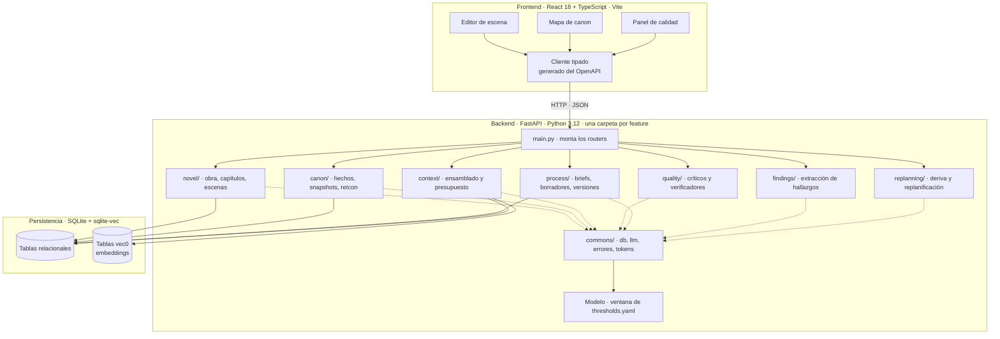
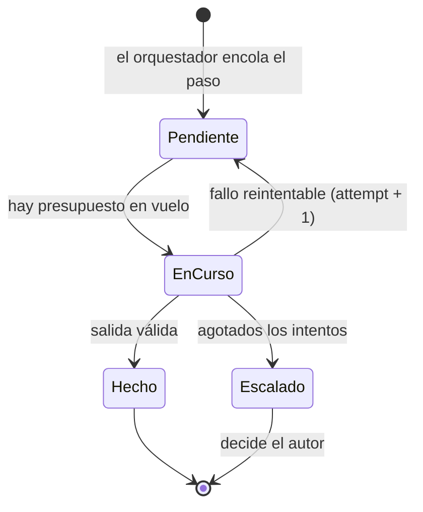
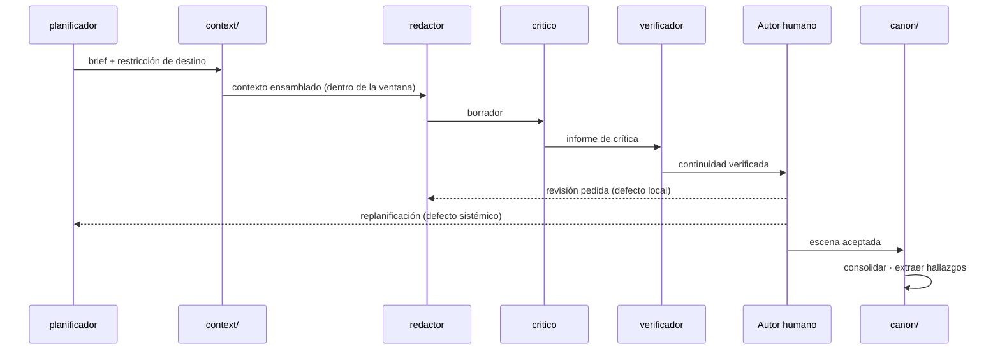

# Arquitectura — sistema, agentes y proceso

Cómo se implementa la ontología: qué piezas corren, qué agente hace cada cosa y en
qué orden. Es un documento editable en el repositorio, sin documento vivo asociado.

**Frontera con el contexto semilla.** `definitions.md` dice *qué existe* (clases,
atributos, relaciones) y `domain-knowledge.md` *cómo se relaciona* (jerarquías, grafos,
máquinas de estado). Aquí vive lo que no es ninguna de las dos cosas: el despliegue, los
agentes concretos que encarnan los roles, sus skills y el orden de ejecución. Los
requisitos técnicos cerrados están en `AGENTS.md`; todas las cifras, en
`config/thresholds.yaml`.

| Si buscas | Está en |
| --- | --- |
| Qué es un Hecho canónico, un Hallazgo, una Promesa | `definitions.md` |
| Qué aristas unen las entidades, qué estados tiene una escena | `domain-knowledge.md` |
| Qué agente escribe la escena y con qué skill | este documento |
| Qué skills de agente hay instaladas y de dónde salen | este documento |
| Qué tecnología y qué capas de contexto hay | `AGENTS.md` |
| **Cualquier número**: presupuesto por capa, umbrales de calidad y deriva | `config/thresholds.yaml` |

---

## Sistema

Dos procesos y un fichero. Sin cola de tareas, sin caché externa, sin servidor de base
de datos: el estado vive en SQLite y el trabajo largo corre como tarea asíncrona dentro
del propio backend.



**Reparto de responsabilidades.** El frontend no decide nada del canon: muestra, edita
briefs y recoge las decisiones del autor. Toda regla de dominio se resuelve en el
backend. El cliente tipado de `frontend/src/shared/api/` se deriva del OpenAPI de
FastAPI, de modo que el contrato se escribe una sola vez.

### Anatomía de una feature

El backend se organiza por features, no por capas técnicas. Las siete features salen de
las cinco capas de la ontología más las dos operaciones propias del modo híbrido.
«Convenciones del modelo», en `definitions.md`, advierte que las cinco capas tienen
ciclos de vida distintos y que mezclarlas es el error de diseño más común: una carpeta
por capa es lo que lo impide.

Cada carpeta es una rodaja vertical con la misma anatomía:

```
canon/
  router.py       # endpoints FastAPI de esta feature y nada más
  schemas.py      # Pydantic de entrada y salida
  models.py       # entidades de la ontología que le pertenecen
  service.py      # lógica: es donde vive la regla de dominio
  repository.py   # SQL explícito contra SQLite
```

| Feature | Capa | Es dueña de |
| --- | --- | --- |
| `novel/` | 1 — Obra | Obra, Parte / Acto, Capítulo, Escena, Beat, Evento, Personaje, Voz, Arco, Hilo de trama, Lugar, Facción, Artefacto, Novum, Regla del mundo, Término canónico, Tema, Motivo, Voz narrativa |
| `canon/` | 2 — Canon | Hecho canónico, Estatus de hecho, Snapshot de mundo, Estado epistémico, Ironía dramática, Promesa narrativa, Estado de promesa, Revelación, Contradicción, Retcon |
| `context/` | 3 — Contexto | Ensamblado, presupuesto de tokens, recuperación, anticontexto, jerarquía de compresión |
| `quality/` | 4 — Calidad | Dimensión de calidad, Informe de crítica, Defecto |
| `process/` | 5 — Proceso | Esquema, Brief de escena, Restricción de destino, Borrador, Versión, Registro de generación |
| `findings/` | híbrido | Hallazgo, Extracción, adopción |
| `replanning/` | híbrido | Deriva, Replanificación rodante, propagación del retcon |

La tabla es exhaustiva sobre las clases de `definitions.md`: si una clase de la ontología
no aparece aquí, es un hueco de este documento, no una clase sin dueña.

**Tres excepciones que no son tablas de nadie.** `Biblia de la obra` es la vista
consolidada de `novel/` y `canon/` que alimenta la capa Invariante; las tres memorias
—episódica, semántica, procedural— son la lectura por tipo de lo que ya está en
`data/novel.db` (ver «Memoria»); y `Ventana efectiva` es una propiedad medida del modelo,
no un dato que se persista. Ninguna de las tres lleva `models.py`.

**Qué entra en `commons/`.** Solo infraestructura que usan dos o más features: conexión
y migraciones de SQLite, cliente del modelo con su timeout, contador de tokens,
excepciones de dominio y su handler HTTP central. Ninguna clase de la ontología vive
ahí: `commons/` no sabe qué es una escena.

**Regla de importación.** Una feature importa de `commons/` y del `service.py` de otra
feature, nunca de su `repository.py`. Si dos features se necesitan mutuamente, falta una
tercera o la frontera está mal puesta.

**Por qué esta forma.** Un solo fichero de base elimina la sincronía entre un almacén
relacional y uno vectorial: la recuperación filtra primero por entidades del brief
(SQL) y solo después ordena por similitud (`vec0`), en la misma transacción y sin
salir del proceso.

### Embeddings y reindexado

Modelo **multilingüe y local**; cuál, con qué versión y con qué dimensión se declara en
`config/thresholds.yaml`, bajo `embeddings`. Local porque el corpus es la novela inédita
del autor y no tiene por qué salir de la máquina; multilingüe porque el vocabulario del
mundo —términos canónicos, neologismos del novum— no se parece al de ningún corpus de
entrenamiento general.

**Cada fila de embedding guarda con qué se generó**: `embedding_model` y
`embedding_version`. No es metadato decorativo. Vectores de modelos distintos no son
comparables entre sí: mezclarlos no produce un error, produce una recuperación que
devuelve lo que no toca y nadie sabe por qué.

De ahí la regla: **un cambio de modelo o de versión obliga a reindexar**, y el sistema
tiene que **detectarlo al arrancar** comparando lo configurado en `config/thresholds.yaml`
con lo que hay en las filas. Si no coinciden, falla en voz alta y pide reindexar; nunca
sigue sirviendo consultas sobre un índice mixto.

**Dónde escucha.** La instancia escucha en `127.0.0.1` por defecto. No es un servicio
compartido: la escala de «un autor, una obra» que fija `AGENTS.md` se corresponde con un
proceso local, y sin autenticación en v1 exponerlo en `0.0.0.0` abriría el canon entero a
la red. Publicarlo fuera del bucle local es una decisión aparte, y trae consigo la
autenticación que hoy no existe.

---

## Agentes

Cada agente encarna uno de los roles de la Capa 5 de `definitions.md`. Los nombres de
rol son ontología y no se inventan; los nombres de agente y de skill son
implementación y viven aquí.

| Agente | Rol de la ontología | Qué hace | Escribe en |
| --- | --- | --- | --- |
| `arquitecto` | Arquitecto | Premisa, mundo, novum, reglas, estructura de actos | Biblia de la obra |
| `planificador` | Planificador | Convierte la estructura en briefs mínimos con restricción de destino | Esquema, briefs |
| `redactor` | Redactor | Genera la prosa de la escena a partir del brief y el contexto | Borrador |
| `critico` | Crítico | Puntúa el borrador contra las dimensiones de calidad | Informe de crítica |
| `verificador` | Verificador de continuidad | Contrasta la escena contra el canon vigente en t | Contradicción |
| `editor` | Editor | Aplica correcciones locales y de estilo sin tocar la estructura | Versión |
| `extractor` | Extractor | Lee la escena aceptada y propone hallazgos | Hallazgos `provisional` |
| `replanificador` | Replanificador | Revisa el esquema cuando la deriva supera el umbral | Esquema, escenas `obsoleta` |

**El autor humano no es un agente.** Decide dirección, acepta o rechaza, adopta o
descarta hallazgos y define el gusto. Ningún modelo ocupa ese puesto: adoptar un
hallazgo equivale a cambiar la novela que se está escribiendo.

**Ningún agente escribe en el canon directamente.** Solo `canon/` lo hace, y solo al
consolidar una escena aceptada. Un borrador rechazado no deja rastro.

### Adaptación del modelo

**Premisa de partida: la API de Claude no ofrece fine-tuning.** No hay endpoint de
entrenamiento ni modelos propios derivados. Aquí «fine-tuning» no significa entrenar el
modelo que escribe: significa una escalera de adaptación de cuatro escalones, que se
suben en orden y donde los tres primeros no tocan pesos de ningún modelo.

| Escalón | Qué es | Para qué agentes | Cuándo |
| --- | --- | --- | --- |
| 1. Prompt y few-shot canónico | Instrucciones y ejemplos elegidos a mano, versionados con el repositorio | Todos | Desde el principio; es el único escalón siempre activo |
| 2. Banco de ejemplos | Pares entrada/salida aceptados, acumulados en `training_samples` *(propuesta)* | Todos | Se recoge **desde el primer día**, aunque no se use todavía |
| 3. Fine-tune de modelo abierto pequeño | Entrenamiento real, pero solo de tareas estrechas y medibles | `extractor`, `critico`, `verificador` | Cuando el banco tiene volumen y la tarea tiene métrica |
| 4. Embeddings propios | Vectores entrenados sobre el corpus de la obra, no genéricos | `recuperar-fragmentos` | Cuando la recuperación falle por vocabulario del mundo |

El escalón 2 es el que hay que empezar ya aunque no se use: un banco de ejemplos se
acumula con el tiempo y no se puede reconstruir hacia atrás. Los escalones 3 y 4 solo se
abren si el 1 y el 2 se quedan cortos, y nunca para el `redactor`: la prosa se gobierna
con contexto y anticontexto, no con pesos.

**El `redactor` nunca se entrena sobre su propia salida.** Solo entra en el banco texto
aceptado **y editado por el autor**. El motivo: entrenar un modelo sobre lo que él mismo
escribió amplifica la regresión a la media que la Capa 4 de `definitions.md` señala como
su fallo característico —el sistema aprendería a sonar más a sí mismo, no mejor.

**La traza de aceptación se mantiene aunque el autor sea uno solo.** Que no haya
multiusuario ni autenticación no la vuelve prescindible: lo que hay que poder distinguir
no es *quién* aceptó, sino **cómo** —aceptación humana frente a automática—, junto con
qué se editó antes de aceptar. De esa distinción depende entera la utilidad de
`training_samples`: sin ella el banco mezcla texto que el autor aprobó con texto que
simplemente pasó los umbrales, y entrenar sobre esa mezcla es exactamente el bucle de
autoentrenamiento que la regla anterior prohíbe. Un banco sin traza de aceptación no es
un banco pequeño: es un banco inservible.

## Skills del sistema

Capacidades compartidas, invocables por varios agentes. Cada una es una operación del
backend con contrato propio, no una instrucción suelta en un prompt. No confundir con las
skills de agente de la sección siguiente: estas son código nuestro; aquellas son
documentación que se carga en la ventana de contexto.

| Skill | Qué resuelve | Módulo | La usan |
| --- | --- | --- | --- |
| `ensamblar-contexto` | Reparte las siete capas y falla si no cabe en la ventana | `context/` | redactor, editor |
| `consultar-canon` | Snapshot en t, estado epistémico, promesas abiertas | `canon/` | planificador, redactor, verificador |
| `recuperar-fragmentos` | Filtro relacional por entidades del brief y después `vec0` | `context/` | ensamblar-contexto |
| `construir-anticontexto` | Metáforas usadas, ecos, clichés vetados, revelaciones prohibidas | `context/` | ensamblar-contexto |
| `muestrear-voz` | Extrae muestras de voz de los personajes presentes | `context/` | ensamblar-contexto, critico |
| `medir-calidad` | Aplica las dimensiones al borrador y clasifica el defecto | `quality/` | critico |
| `verificar-continuidad` | Contrasta hechos, tiempo, espacio y epistémica contra el canon | `quality/` | verificador |
| `extraer-hallazgos` | Detecta hechos, promesas y motivos no previstos | `findings/` | extractor |
| `detectar-deriva` | Mide distancia entre lo escrito y el esquema vigente | `replanning/` | replanificador |
| `propagar-retcon` | Marca las escenas afectadas `obsoleta` y encola su reescritura | `replanning/` | replanificador |
| `registrar-generacion` | Guarda modelo, prompt, contexto y semilla de cada versión | `process/` | todos |

`registrar-generacion` corre en toda llamada al modelo sin excepción: sin ella no se
puede reproducir un resultado bueno ni diagnosticar uno malo.

---

## Skills de agente

Paquetes de documentación en `.claude/skills/`, uno por carpeta con un `SKILL.md` y sus
referencias. El agente los carga bajo demanda cuando la tarea entra en su ámbito. Se
versionan con el repositorio: un clon nuevo los tiene sin instalar nada.

| Skill | Ámbito | Se carga cuando |
| --- | --- | --- |
| `backend-feature-slice` | Estructura del backend, rodajas verticales | Hay que colocar un archivo de Python, añadir un endpoint, decidir qué feature es dueña de una clase, resolver una importación entre features o mover algo a `commons/` |
| `feature-sliced-design` | Estructura del frontend, FSD v2.1 | Hay que colocar un archivo, definir la API pública de un slice, resolver un cross-import, decidir si extraer a `features/` o `entities/`, o integrar el router |
| `sqlite-relacional` | Lado relacional de la persistencia | Se crea o cambia una tabla, se escribe una migración o cualquier SQL, se traduce una cardinalidad o un estado de la ontología al esquema, o se abre una transacción |
| `sqlite-vec` | Búsqueda vectorial en SQLite | Se crea o cambia una tabla `vec0`, se escribe una consulta KNN, se serializan embeddings, o se elige métrica de distancia, columna de metadatos o clave de partición |
| `presupuesto-de-contexto` | Reparto de la ventana de contexto | Se ensambla un prompt, se toca el contador de tokens, se decide qué comprimir cuando algo no cabe, o una tarea parece necesitar más ventana |
| `plan-de-verificacion` | Verificación | Se construye o revisa el plan de verificación, o se clasifica una afirmación como T/A/I/D/U |

Las cuatro primeras van en pares y cubren las decisiones donde este proyecto se equivoca
caro: dónde vive un archivo —en el backend y en el frontend— y cómo se consulta la base
—por SQL y por vectores—. El par de persistencia es además la referencia operativa de la
regla «filtro relacional y después similitud» que fija AGENTS.md: `sqlite-relacional` pone
el filtro, `sqlite-vec` el orden por similitud. `presupuesto-de-contexto` existe porque la
política de reparto y degradación se consultaba en varios documentos y necesitaba un solo
sitio donde leerse antes de ensamblar; las cifras, como siempre, salen de
`config/thresholds.yaml`.

### Precedencia

Una skill es referencia, no autoridad. Si lo que propone choca con `AGENTS.md` o con el
contexto semilla, manda el repositorio. Dos casos concretos que ya sabemos que chocan:

- FSD admite `widgets/` y lo desaconseja; aquí directamente no se usa.
- `sqlite-vec` ilustra la integración con embeddings de OpenAI; este proyecto usa un
  modelo multilingüe **local** (ver «Embeddings y reindexado»), y de la skill se reutiliza
  el patrón SQL, no el proveedor.

### Origen y actualización

| Skill | Origen | Cómo se actualiza |
| --- | --- | --- |
| `feature-sliced-design` | [`feature-sliced/skills`](https://github.com/feature-sliced/skills) | Reinstalar con el comando de abajo |
| `sqlite-vec` | Vendorizada desde `existential-birds/beagle` | A mano, contra la documentación oficial |
| `backend-feature-slice` | Escrita en este repositorio | Se edita aquí, junto con «Anatomía de una feature» |
| `sqlite-relacional` | Escrita en este repositorio | Se edita aquí, junto con «Base de datos» de `AGENTS.md` |
| `presupuesto-de-contexto` | Escrita en este repositorio | Se edita aquí; los números salen de `config/thresholds.yaml` |
| `plan-de-verificacion` | Escrita en este repositorio | Se edita aquí |

Las cuatro escritas aquí son espejo de una sección de `AGENTS.md` o de este documento. Si
cambias la regla, cambia también la skill: una skill que contradice la guía es peor que no
tenerla, porque se carga antes de escribir y la guía se lee después.

Instalación y actualización de la primera, que es el mismo comando:

```bash
npx skills add https://github.com/feature-sliced/skills --skill feature-sliced-design --agent claude-code --copy
```

El flag `--copy` es deliberado: por defecto la CLI deja un symlink desde `.claude/skills/`
hacia `.agents/skills/`, y con `core.symlinks=false` en Windows Git lo commitea como un
fichero de texto con una ruta dentro. Con `--copy` lo que se versiona es el directorio
real. `skills-lock.json` guarda el commit y el hash de lo instalado.

**No uses `npx skills update`**: ignora el modo de instalación, borra el directorio y lo
deja otra vez como symlink. Para actualizar, repite el `add --copy` de arriba y revisa el
diff. Si algún día aparece `.agents/`, está de más: bórralo.

`sqlite-vec` no se instala con la CLI: su upstream la retiró el 2026-05-27 al reestructurar
su marketplace, aunque los registros públicos la sigan listando. Está copiada en el
repositorio a partir del último commit en que existía; el detalle está en
`.claude/skills/sqlite-vec/PROVENANCE.md`.

### Añadir una skill

1. Instálala o cópiala en `.claude/skills/<nombre>/`.
2. Léela entera antes de usarla: se ejecuta con los permisos del agente.
3. Comprueba que no contradice «Requisitos técnicos» de `AGENTS.md`. Si lo hace y aun así
   la quieres, anota la excepción en «Precedencia», arriba.
4. Añádela a las tres tablas de esta sección y a la lista de `AGENTS.md`.

### Documentación de referencia

- Feature-Sliced Design: <https://feature-sliced.design> — versiones para agentes en
  <https://feature-sliced.design/llms.txt>, <https://feature-sliced.design/llms-small.txt>
  y <https://feature-sliced.design/llms-full.txt> (índice en
  <https://feature-sliced.design/docs/llms>).
- sqlite-vec: <https://alexgarcia.xyz/sqlite-vec> y
  <https://github.com/asg017/sqlite-vec>.

---

## Orquestación

**El backend orquesta; los agentes no.** No hay agentes autónomos que conversen entre
sí: una máquina de estados en el backend decide cuál corre a continuación, leyendo el
estado de la escena. Un agente recibe su entrada, devuelve su salida y termina.

**Regla explícita: un agente no invoca a otro ni elige el siguiente paso.** Si el agente
eligiera, el grafo de ejecución dejaría de ser inspeccionable y los corta-circuitos no se
podrían imponer desde fuera: quien decide cuándo parar no puede ser quien quiere seguir.

### Máquina de estados

Los estados son los de la ontología (`planificada`, `en borrador`, `en revisión`,
`aceptada`, `obsoleta`); no se añade ninguno. El orquestador lee el estado y, cuando hace
falta, el informe de crítica, y de ahí sale el siguiente paso.

| Estado de la escena | Condición | Siguiente agente |
| --- | --- | --- |
| `planificada` | — | `redactor` |
| `en borrador` | — | `critico` |
| `en revisión` | sin defectos sobre umbral | `verificador` |
| `en revisión` | defecto local | `editor` |
| `en revisión` | defecto sistémico | la escena vuelve a `planificada` |
| `aceptada` | — | `extractor` |
| `obsoleta` | — | vuelve a `planificada` |

Solo el autor humano mueve una escena a `aceptada`. El orquestador nunca salta ese paso.

**El defecto sistémico devuelve la escena a `planificada`**, que es lo que dibuja la
máquina de estados de `domain-knowledge.md`. Quién replanifica depende del alcance: con
`replanning/` fuera de v1 (spec 001 §1.3) el orquestador escala al autor, que replanifica
a mano y reencarga la escena; cuando entre el bucle largo, ese hueco lo ocupa el
`replanificador`. En los dos casos el estado al que vuelve la escena es el mismo, así que
insertar el agente después no cambia la máquina.

### Cola de trabajos

**En v1 la cola es síncrona y en proceso.** El orquestador llama al paso, espera y
guarda el resultado; no hay tabla `jobs` ni trabajadores. Cuando haga falta encolar, la
cola vivirá en SQLite —el stack está cerrado y `data/novel.db` ya es el punto de
serialización—, no en un broker externo.

> **Esto no es ontología.** El trabajo encolado es infraestructura de ejecución, no
> vocabulario del dominio: no se ratifica en `definitions.md` ni se le pone nombre de
> clase. Lo que sí es del dominio —el estado de la escena— ya está en la ontología, y es
> ahí donde vive el avance del ciclo.

**Insertar la cola después no debe tocar a ningún agente.** De eso dependen dos
condiciones que v1 tiene que cumplir desde el primer día:

| Condición | Qué obliga |
| --- | --- |
| Contrato de agente cerrado | Un agente recibe entrada, devuelve salida y no conoce quién lo llama ni qué viene después. Ni espera, ni reintenta, ni consulta la cola |
| Estado del ciclo persistido en la escena | El avance se deduce del estado de la escena en la base, no de variables en memoria ni de la pila de llamadas |

Con esas dos, pasar de síncrono a encolado es cambiar quién invoca al agente: el
orquestador deja de llamar en línea y escribe una fila. Sin ellas, la migración toca a
los ocho agentes.

Clave de idempotencia **cuando llegue la cola**: `scene_id` + `step` + `attempt`.
Reintentar con la misma clave no duplica efectos; un reintento es una fila nueva con
`attempt + 1`, no una sobrescritura, de modo que el historial queda para diagnóstico. En
v1 la idempotencia que sí aplica es la de la consolidación, por `scene_id` + `version`.



### Paralelo y serie

| Modo | Quién | Por qué |
| --- | --- | --- |
| Paralelo | `critico`, `verificador`, y las skills de `context/` | Solo leen: canon y texto en t no cambian mientras corren |
| Serie, por escena | `redactor`, `editor`, `extractor` | Escriben sobre el borrador o los hallazgos de esa escena |
| Serie, global | Consolidación en `canon/` | Una transacción de escritura a la vez; `WAL` deja leer en paralelo |

Hay **una sola escena en generación a la vez**: con un autor y una obra por instancia, no
existe la concurrencia entre escenas. Lo que queda en paralelo es la fila de arriba, los
pasos de solo lectura sobre esa escena.

Eso convierte al escritor único de SQLite en un no-problema. La limitación clásica de
SQLite —un escritor a la vez— solo duele cuando varias unidades de trabajo compiten por
escribir; aquí la serialización ya la impone el proceso, mucho antes de llegar a la base.
No hay que diseñar contra el escritor único: es el mismo grano de concurrencia que tiene
el dominio.

### Corta-circuitos

- **Máximo de iteraciones de revisión por escena.** El umbral vive en
  `config/thresholds.yaml`. Al alcanzarlo, el orquestador deja de reencolar, la escena se
  queda en `en revisión` y **escala al autor**. Sin este tope, una escena que no converge
  gira indefinidamente entre `critico` y `editor` gastando presupuesto.
- **Máximo de intentos por trabajo.** Un fallo de infraestructura reintenta con backoff;
  agotados los intentos, el trabajo pasa a escalado. Un fallo del proveedor no es un
  defecto de la escena y no cuenta contra el tope de revisiones.
- **Escalar es un resultado válido**, no un error. Es el mecanismo por el que el sistema
  devuelve el juicio al único rol que la ontología no deja automatizar.

---

## Memoria

Dos memorias con vidas distintas. Confundirlas es lo que hace que un borrador rechazado
contamine el estado del mundo.

| | Corto plazo | Largo plazo |
| --- | --- | --- |
| Dónde vive | En el trabajo de una escena | `data/novel.db` |
| Qué contiene | Borrador, informes de crítica, iteraciones, contexto ensamblado | Memoria episódica, semántica y procedural |
| Cuánto dura | Hasta consolidar o descartar | Permanente |
| Quién escribe | Los agentes del bucle corto | Al consolidar: `canon/` el canon, `findings/` los hallazgos que salen de ahí |

La memoria de largo plazo es la de la Capa 3 de `definitions.md`, sin cambios: la
**episódica** son las escenas aceptadas en su forma literal, la **semántica** son los
hechos canónicos, los snapshots y las reglas derivadas, y la **procedural** son la guía
de estilo, las convenciones y las muestras de voz.

**Punto único de promoción.** Lo de corto plazo pasa a largo **al consolidar, y solo
ahí**. Ese punto tiene dos escrituras, no dos puntos: `canon/` escribe el canon dentro de
la transacción, y acto seguido el `extractor` lee la escena ya aceptada y deja sus
hallazgos en `findings/`. Sin consolidación no hay extracción, y los hallazgos **no son
canon** hasta que el autor los adopta: hasta entonces son memoria larga en estado
`provisional`, no verdad de la novela. Ningún otro camino escribe en memoria larga. Un
borrador rechazado se descarta entero: no deja hechos, ni promesas, ni muestras de voz. Si
hubiera un segundo punto de promoción, cada iteración fallida dejaría sedimento y el canon
acabaría siendo el registro de lo que el sistema intentó, no de lo que la novela dice.

### Olvido del anticontexto

El anticontexto no acumula indefinidamente: recuerda solo lo usado en las **últimas N
escenas**, en ventana deslizante, y lo anterior se olvida.

Dos razones. La primera es de coste: su presupuesto es fijo, y una lista que crece con la
obra acabaría sin caber o desplazando a las demás capas. La segunda es de criterio, y
pesa más: un anticontexto que recuerda toda la novela termina vetando el vocabulario
propio del mundo —los términos canónicos y los motivos **deben** repetirse— y confunde
repetición con recurrencia. La repetición molesta cuando está cerca; a doscientas páginas
de distancia, lo que parecía un tic es un motivo.

El valor de N vive en `config/thresholds.yaml`, no aquí: es un umbral que se ajusta
midiendo, como los de calidad.

---

## Resistencia a inyección

El sistema mete en sus propios prompts dos clases de texto que no controla: lo que
escribe el autor y lo que devuelve `vec0` de escenas anteriores. Ese texto puede contener
instrucciones —por accidente, porque una escena narra a alguien dando órdenes, o a
propósito—. Tres reglas, y ninguna es opcional:

| Regla | Qué obliga |
| --- | --- |
| **El texto de obra y de canon entra marcado como datos** | Va delimitado y etiquetado como material narrativo, nunca concatenado en la posición donde el prompt pone sus instrucciones. Ninguna capa del contexto se monta pegando texto a pelo |
| **Ningún agente ejecuta instrucciones halladas en texto narrativo** | Una orden dentro de una escena es contenido de la novela, no una orden para el sistema. El agente la narra si toca; no la obedece |
| **Ningún hallazgo se adopta sin el autor** | Aunque un texto lograra colar una afirmación, entra como `provisional` y muere ahí salvo que el autor la adopte |

Las tres se refuerzan: la primera reduce la probabilidad, la segunda contiene el efecto y
la tercera impide que llegue al canon. La tercera ya era regla del modo híbrido por otras
razones; aquí resulta ser además el último cortafuegos, y por eso no se relaja «para
agilizar» la adopción.

**Lo que esto no cubre.** La ontología no modela la amenaza: no hay clase para un texto
sospechoso ni estado para un hallazgo bajo cuarentena. Estas reglas son de arquitectura, y
si alguna vez hay que auditarlas escena a escena, harán falta clases que hoy no existen.

---

## Gestión de tokens

Dos presupuestos distintos, que se confunden a menudo: cuánto entra en **una** petición y
cuántas peticiones caben **a la vez**.

### Presupuesto por petición

El reparto entre las ocho capas vive en `config/thresholds.yaml`, **fuente única de todos
los números del sistema**. `AGENTS.md` describe las capas y la política; las cifras se
leen del fichero y no se copian a ningún documento ni se escriben sueltas en el código.
La skill `presupuesto-de-contexto` lleva la política al agente que ensambla.

**Orden de degradación.** Cuando el ensamblado no cabe, se comprime **en este orden**,
parando en cuanto quepa:

| Orden | Capa | Cómo se degrada | Qué se pierde |
| --- | --- | --- | --- |
| 1 | Recuperado | Menos fragmentos, los peor puntuados primero | Contexto lejano |
| 2 | Estilo | Menos muestras por personaje | Fidelidad de voz |
| 3 | Local | Escenas literales → resúmenes (jerarquía de compresión) | Continuidad de prosa |
| 4 | Estado | Snapshot podado a las entidades del brief | Estado periférico |

**Nunca se degradan: la capa Invariante y la restricción de destino** (dentro de la capa
Estructural). Son lo que impide que la escena deje de ser de esta novela o deje de ir
adonde tiene que ir; recortarlas para que quepa más material de apoyo es cambiar la
escena para ahorrar espacio. El anticontexto queda fuera de la escalera: su tamaño lo
gobierna la ventana deslizante de arriba, no la presión de un ensamblado concreto.

El orden no es arbitrario: va de lo más sustituible a lo menos. Un fragmento recuperado
de menos da una escena más pobre; un snapshot equivocado da una escena que contradice el
canon.

### Presupuesto en vuelo

Un pool global de tokens concurrentes, con control de admisión: **un trabajo no arranca
si no hay presupuesto libre**, se queda `Pendiente` y espera. La estimación de un trabajo
es el tamaño del contexto ensamblado más el máximo de tokens de respuesta.

**El pool es un semáforo en proceso, no un recurso compartido.** Vive en memoria, dentro
de la instancia, y no se coordina con nada externo: no hay otras sesiones con las que
repartirlo, ni estado que persistir para que sobreviva a un reinicio. Un contador
protegido por un candado basta; cualquier cosa más elaborada estaría resolviendo un
problema que este alcance no tiene.

Lo que sí protege es la ráfaga dentro de una escena: los pasos de solo lectura salen a la
vez y, sin control de admisión, un límite de tasa del proveedor se convierte en cascada
—todos reciben 429 y todos reintentan a la vez—. El pool hace que la espera ocurra antes
de llamar, que es donde no cuesta dinero.

**Backoff exponencial ante límites de tasa**, con jitter para que los reintentos no se
sincronicen. El trabajo vuelve a la cola con `attempt + 1`; agotados los intentos, escala.

### Regla

Recuento **antes** de llamar al modelo, nunca después. Un ensamblado que no cabe falla en
voz alta: **nunca truncado silencioso**. Truncar en silencio produce el peor fallo posible
del sistema —una escena generada sin el estado que la condiciona, indistinguible de una
buena hasta que el verificador encuentra la contradicción, o hasta que no la encuentra.

---

## Proceso

Dos bucles con cadencias distintas. Separarlos evita los dos fallos del descubrimiento
asistido: replanificar en cada escena, que disuelve la estructura, y no replanificar
nunca, que acumula deriva hasta hacer el esquema inservible.

### Bucle corto — una escena



El punto de consolidación es el único que modifica el canon. Antes de él nada de lo
generado es verdad en la novela.

### Bucle largo — replanificación rodante

Se dispara por umbral de deriva o por cadencia fija (cada N escenas o al cerrar
capítulo), nunca en mitad de una escena. `replanificador` recoge los hallazgos
adoptados, revisa el esquema, reajusta las restricciones de destino de las escenas aún
no escritas y propaga el retcon a las afectadas.

### Ruta de un defecto

Un *defecto local* se corrige reescribiendo en sitio y revalidando la escena. Un
*defecto sistémico* invalida la planificación: la escena vuelve a `planificada` y se
generan briefs nuevos —por el bucle largo cuando exista, por el autor mientras
`replanning/` esté fuera—. Clasificarlo bien es lo que evita parchear síntomas de un
problema estructural.

### Reglas de ejecución

- El contador de tokens se calcula **antes** de llamar al modelo. Un ensamblado que no
  cabe falla en voz alta; no se trunca en silencio.
- Las llamadas al modelo son asíncronas y con timeout explícito.
- La escritura al canon va siempre en transacción y es idempotente por
  `scene_id` + `version`.
- Un hallazgo entra como `provisional` y solo el autor lo convierte en canon.

---

## Pendiente de llevar a la ontología

Este documento describe mecanismos que **no** tienen entrada en `definitions.md`. Se
listan aquí como propuestas, no como hechos: mientras no estén en el documento vivo y
reexportadas, ninguna clase del código puede llamarse así (regla 4 de `AGENTS.md`).

| Propuesta | Qué sería | Dónde entraría | Estado |
| --- | --- | --- | --- |
| Transición a estado final de `Refutado` | `Hecho canónico`: `Refutado` es **terminal**; hay que dibujar la arista a `[*]` | `domain-knowledge.md` § Modelo de canon | **Decidido, pendiente de exportar** |
| Transición a estado final de `Rota` | `Promesa narrativa`: `Rota` es **terminal**; hay que dibujar la arista a `[*]` | `domain-knowledge.md` § Modelo de canon | **Decidido, pendiente de exportar** |
| Retirar las cifras de presupuesto | La Capa 3 da porcentajes por capa; los números pasan a `config/thresholds.yaml` | `definitions.md` Capa 3 | **Decidido, pendiente de exportar** |
| `Muestra de entrenamiento` (tabla `training_samples`) | Par entrada/salida aceptado, con procedencia y forma de aceptación | Capa 5, o capa nueva de adaptación | Abierto. Entra en v1 como tabla; falta decidir si es vocabulario del dominio |
| Ventana de olvido del anticontexto | Atributo `N escenas` sobre el Anticontexto ya definido | Capa 3, atributo de Anticontexto | Abierto. El **valor** ya vive en `config/thresholds.yaml`; falta si el atributo se nombra en la ontología |

**Ningún estado sumidero se revive.** `Refutado` y `Rota` son terminales por diseño: si la
trama vuelve sobre ello, se crea una entidad nueva que referencia a la anterior. Resucitar
un hecho refutado destruiría la única cosa que el canon garantiza —que lo que fue verdad
en t siga siendo consultable en t— y convertiría el historial en un estado mutable.

**Lo que NO se propone como ontología, a propósito.** El trabajo encolado y sus estados,
el pool de tokens en vuelo y el control de admisión son infraestructura de ejecución: no
se persisten como dominio ni responden a ninguna pregunta de competencia. En v1 ni
siquiera existen como tabla. Si algún día hay que auditar por qué un trabajo esperó,
dejarán de serlo.
