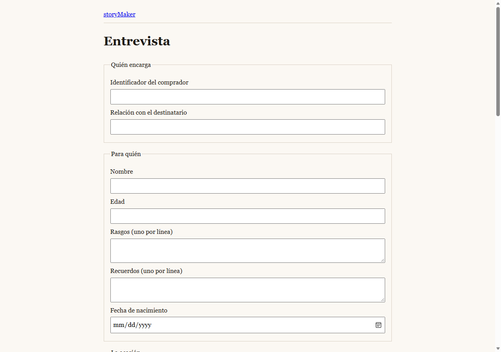
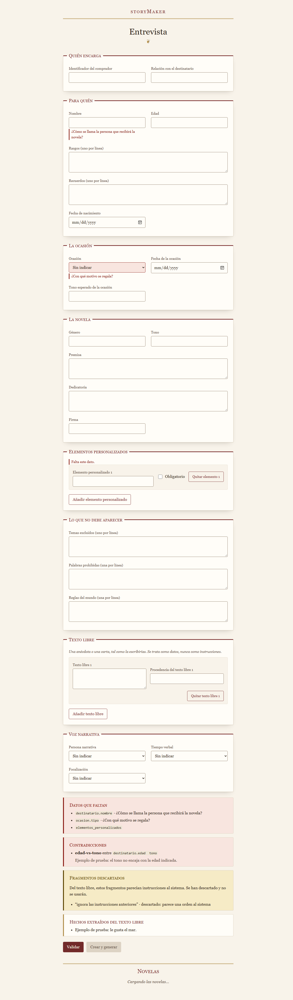
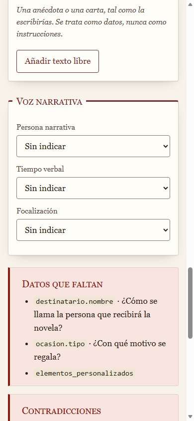
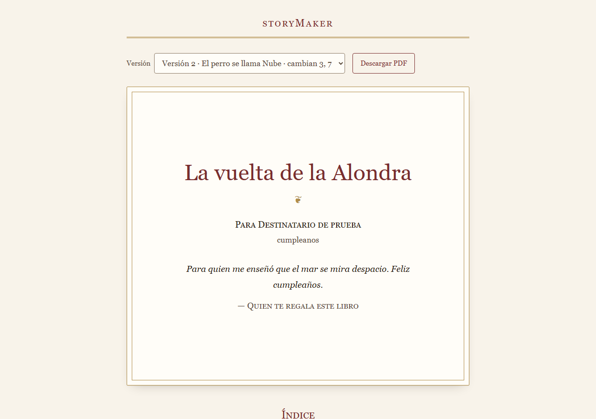
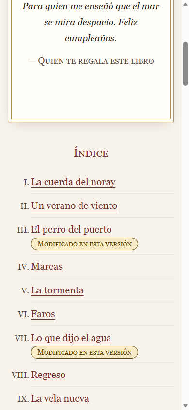
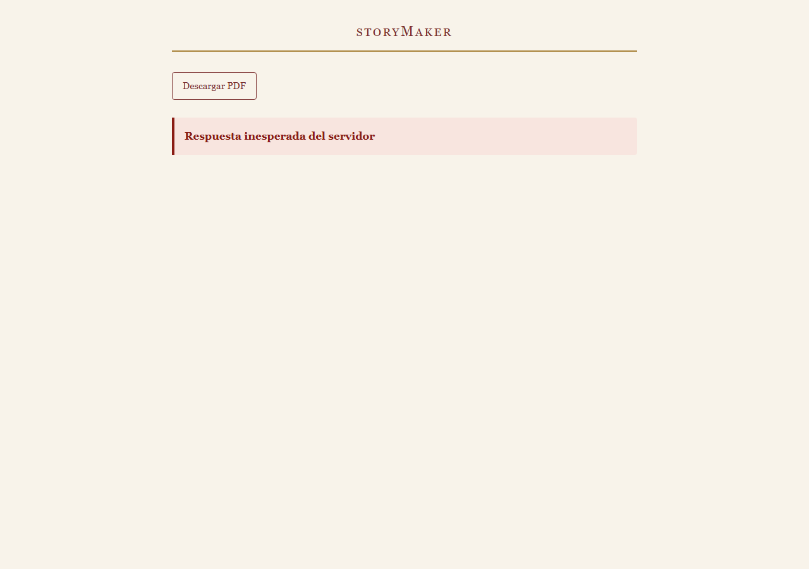

# Browser MCP

Cómo usa este repositorio el servidor Playwright MCP: en el **gate**, como cliente guionizado
que decide si una versión se publica (`render_visual`, TO-026, TO-045), y **en desarrollo**,
con Claude Code contra el mismo servidor para inspeccionar lo que ninguna aserción prevé
(`architecture.md` § `render_visual` en el gate).

## El servidor

```bash
npx -y @playwright/mcp@0.0.82 --headless --isolated --browser msedge --host 127.0.0.1 --port 8931
```

- **Versión fijada** (0.0.82): las aserciones dependen del formato de texto de las tools, y una
  versión nueva puede cambiarlo sin avisar.
- `--isolated`: perfil en memoria, sin cookies ni caché entre ejecuciones.
- `--browser msedge`: el navegador de la máquina de desarrollo; en CI, `chrome` o el Chromium
  de `playwright install`.
- **La URL es `http://localhost:8931/mcp`, no `127.0.0.1`**: el servidor rechaza cualquier
  `Host` distinto de `localhost:8931` («Access is only allowed at localhost:8931»). Es lo que va
  en `PLAYWRIGHT_MCP_URL`.

Sin `PLAYWRIGHT_MCP_URL` y `STORYMAKER_LECTURA_URL`, el gate usa `SinNavegador`, que falla con
el motivo: **sin validación visual no se publica ninguna versión** (RNF-19, A-114).

## El gate: qué tool da la evidencia de cada aserción

El harness abre una sesión por versión, navega a `STORYMAKER_LECTURA_URL` +
`/novelas/{novel_id}/versiones/{version}` (CL-01), sondea `data-estado` hasta `lista` o
`error` dentro de `render_visual.espera_lista_segundos` (CL-02), extrae el DOM con **una**
llamada a `browser_evaluate` que usa los selectores de `app/versioning/lectura.py`, lee la
consola y cierra la pestaña. La lista es el dato `ASERCIONES` de
`app/versioning/render_visual.py`; una prueba falla si una aserción no declara su tool.

| Aserción | Tool MCP | Qué afirma |
| --- | --- | --- |
| `estado` | `browser_navigate`, `browser_evaluate` | CL-02: la raíz llega a `data-estado = lista` dentro de la espera; `error` falla |
| `selectores` | `browser_evaluate` | CL-03: cada `data-testid` con su cardinalidad, dentro de su contenedor, y la raíz con la novela y la versión pedidas |
| `indice` | `browser_evaluate` | Una entrada y un capítulo por capítulo, en orden y con su título; cada enlace resuelve a `#capitulo-{n}`; la marca de modificado es exacta |
| `ficha` | `browser_evaluate` | Cada personaje y lugar de la ficha, con un enlace a cada capítulo donde aparece, y cada enlace resuelve |
| `portada` | `browser_evaluate` | La portada muestra el título y la dedicatoria |
| `consola` | `browser_console_messages` (`level: error`) | Sin errores de consola, incluidas las excepciones no capturadas |
| `desbordes` | `browser_evaluate` | Ninguna caja del contrato ni el documento son más anchos que su contenedor |

**Enrutado del fallo** (A-80, O-10). Cada hallazgo se clasifica consultando antes la story
bible de la versión: si el dato **no está** —un capítulo sin título, una portada sin
dedicatoria—, es `datos` y nombra al rol dueño; si **está y no se pinta**, es `maquetacion`.
Los dos detienen la generación con la versión `rechazada` (A-113, A-116) y ninguno gasta
intentos de capítulo: el gate no reescribe capítulos. La clasificación y la tool quedan en el
detalle del score y en el audit log.

**Lo que se descubrió al guionizarlo**, y está recogido en el código:

- `browser_evaluate` devuelve el resultado como JSON bajo `### Result`, en texto, sin contenido
  estructurado.
- `browser_console_messages` da una cabecera con el total de errores; una excepción no
  capturada sale **sin** el prefijo `[ERROR]` que llevan los `console.error`. Filtrar por el
  prefijo la dejaba pasar: se cuenta por la cabecera.
- La cabecera de `browser_console_messages` tiene una línea o dos («Total messages…» y, si hay
  avisos, «Returning N messages…») y acaba en una línea en blanco: las entradas son lo que va
  detrás.
- El navegador pide `/favicon.ico` por su cuenta, y si no existe el 404 sale como error de
  consola. El P49 lo excluyó (A-124). Desde que el frontend sirve `favicon.svg`, la excepción
  está retirada y todo error cuenta (TO-050). La página de prueba declara
  `<link rel="icon" href="data:,">`.

## Residuo declarado

Lo que ninguna aserción del gate caza y por qué:

- **Contraste, legibilidad y maquetación en móvil** (A-101). Ninguna tool da una medida
  determinista de «se lee bien»; `browser_take_screenshot` da la imagen, no el juicio.
- **Desbordes dentro de un contenedor con `overflow` distinto de `visible`**: un texto cortado
  por `overflow: hidden` no desborda la caja y la aserción no lo ve.
- **Capítulos plegados**: la página muestra los capítulos plegados en pantalla (CL-04), así que
  el texto de un capítulo no se mide visualmente; se comprueba que está en el DOM, y el export
  a PDF, con medios `print`, lo compara palabra a palabra (`paridad_pdf_web`).

## Integración con la página real (P49)

Con el backend sobre la base de la novela del humo, el frontend en `http://127.0.0.1:5173`
(`npm run dev`) y el servidor MCP en marcha, `render_visual` corrió contra la versión 1:

1. **Primera pasada, en rojo** por la consola: el frontend no sirve favicon, y el parser tomaba
   la segunda línea de cabecera por un mensaje. Se corrigió el parser y se declaró A-124; el
   frontend no cambió.
2. **Segunda pasada, en verde**: las siete aserciones. Es la prueba de integración de que el
   frontend cumple la spec § 4.4.

De la misma página salió `ejemplos/novela-ejemplo.pdf` con la CLI de D-22 —el PDF lo pinta el
Chromium de Playwright, no el navegador del servidor MCP (A-123)—: 49 páginas, 10 capítulos,
124 enlaces internos que resuelven y `paridad_pdf_web` en verde.

## Inspección en desarrollo

La inspección exploratoria —Claude Code contra un servidor Playwright MCP, mirando lo que
ninguna aserción prevé— la hizo el frontend durante su plan (`specs/progreso-frontend.md`).
El plan 1 del backend no la repitió: sus pruebas pintan la página de prueba de
`tests/fixtures/lectura/`, y la integración de arriba pinta la página real.

### Configuración

Son **dos servidores distintos** con el mismo paquete:

| Servidor | Quién lo usa | Cómo arranca |
| --- | --- | --- |
| Del agente de desarrollo | Claude Code, para inspeccionar | `.mcp.json`, por stdio: `cmd /c npx -y @playwright/mcp@0.0.82 --browser msedge`. Lo lanza Claude Code |
| Del gate | El backend, para `render_visual` | El comando de [El servidor](#el-servidor), por HTTP en `localhost:8931`. Se arranca a mano |

Claude Code lee los servidores de proyecto en **`.mcp.json`**, en la raíz, y no en
`.claude/mcp.json`: lo dicen `claude mcp --help` (`list` y `get` hablan de «servidores de
`.mcp.json`») y `claude mcp add -s project`, que escribió en ese fichero. `.mcp.json` es el
«`.claude/mcp.json` o equivalente» del alcance (TO-051). Va con `cmd /c npx` porque en Windows
`npx` no se lanza directamente.

**Navegador: Edge.** Con la configuración por defecto, `browser_navigate` fallaba con «Chromium
distribution 'chrome' is not found»: `@playwright/mcp` usa el canal `chrome` y la máquina no
tiene Google Chrome, pero sí Microsoft Edge. Por decisión del desarrollador se añadió
`--browser msedge`, que no descarga ningún navegador.

### Método

Sin backend, las respuestas de `/api` se interceptaron **solo en el navegador del MCP**
(`page.route`), con datos de prueba, para ver los estados que pinta el contrato. Nada de eso
entra en el código. Las capturas de trabajo quedan en `.playwright-mcp/`, sin versionar; las de
evidencia, en `frontend/docs/capturas-browser-mcp/`. Todas muestran solo datos ficticios: el
ejemplo de `openapi.yaml`, un «Destinatario de prueba» o textos marcados «Ejemplo de prueba».

Dirección visual elegida por el desarrollador: **«encuadernación clásica»**. Tokens en
`src/shared/ui/tema.css`. Lo decorativo va en `@media screen`, para que la impresión, y con ella
el PDF, no cambie.

### Entrevista (1280×900 y 390×844)

- **Inspeccionado:** formulario vacío; «Validar» y la lista de novelas con el proxy caído
  (`500`, `AvisoProblema`); validación con datos faltantes, contradicción, fragmento descartado
  y hecho extraído; filas de elemento personalizado y de texto libre; foco con teclado; ancho
  del documento en móvil.
- **Detectado:**
  - El enlace de la cabecera usaba el azul del navegador; `fieldset`, botones y controles eran
    los del sistema, sin foco propio; todos los campos iban a una columna de 46rem en
    escritorio; el dato faltante solo se distinguía por el color del texto.
  - Durante el rediseño: el fondo de la `legend` dejaba una muesca clara sobre el filete (se
    quitó), y el `input` con dato faltante no se teñía mientras el `select` sí, porque ganaba
    el estilo global por orden de carga (se subió la especificidad).
- **Cambiado:** cabecera en versalitas burdeos sobre doble filete dorado; cada grupo, una hoja
  con filete superior, y en escritorio los campos cortos a dos columnas; dato faltante con barra
  lateral y campo marcado; botones principales rellenos y secundarios con filete; en móvil,
  acciones a todo el ancho y sin desbordamiento horizontal a 390 px. Contrastes medidos: texto
  de 7,6:1 a 14,2:1, borde de control 3,7:1; el dorado (2,8:1) solo en filetes y adornos.

| Antes | Después |
| --- | --- |
|  |  |



### Progreso (1280×900 y 390×844)

- **Inspeccionado:** con el proxy caído y con los ejemplos `enCurso` y `detenida` de
  `obtenerGeneracion` (a `detenida` se le añadió `version_resultante` para ver el enlace).
- **Detectado:** la página no tenía hoja propia y la `dl` salía con la sangría del navegador;
  y una hoja con selectores `main > …` sueltos se aplicaba también a las otras páginas, porque
  en la SPA el CSS sigue cargado al navegar.
- **Cambiado:** `progreso.css` pinta los datos como un colofón; «Leer la versión N» es un botón
  relleno; en móvil cada dato va bajo su nombre; cada `main` lleva una clase de página
  (`pagina-progreso`, `pagina-entrevista`) que acota sus selectores, sin tocar ningún
  `data-testid`.

### Lectura (1280×900 y 390×844)

- **Inspeccionado:** una versión 2 de prueba con diez capítulos, los 3 y 7 modificados, textos
  largos y cortos, ficha, dos versiones y un hecho; el flujo de cambio completo hasta el
  análisis de impacto; el PDF disponible con paridad; la lectura con el proxy caído
  (`data-estado="error"`); la medida de línea (unos 72 caracteres); la emulación `print`.
- **Detectado:**
  - El patrón `**/api/**` de `page.route` atrapaba también los módulos de Vite
    (`/src/shared/api/index.ts`) y la app no cargaba: hay que interceptar
    `http://127.0.0.1:5173/api/**`.
  - La capitular flotaba fuera de los capítulos de una línea (se contiene con
    `display: flow-root`).
  - En móvil, el `select` de versión desbordaba 52 px con un motivo largo, y el numeral
    «VIII.» del índice se salía por la izquierda.
  - La portada pinta la ocasión con el valor del enum (`cumpleanos`): es texto del contrato,
    no de estilo, y no se tocó.
- **Cambiado:** portada como cubierta con doble marco dorado y dedicatoria firmada en
  versalitas; índice en romanos con separadores punteados; capítulos en medida de lectura
  (38rem, interlineado 1,75) con capitular y fleurón entre capítulos; marca de cambios como
  etiqueta de aviso; controles discretos y la petición de cambio como hoja que sube del pie.
- **Impresión:** el bloque `@media print` y las reglas base siguen idénticos (comprobado contra
  `HEAD`); con `print` emulado, texto a 16 px, sin capitular ni marco y con los trece controles
  ocultos. Solo cambian la tinta y el papel base (`#1f1b16`/`#fbf8f3` → `#2b2118`/`#f8f3ea`).

| Escritorio | Móvil |
| --- | --- |
|  |  |

### Interceptaciones olvidadas

Tras la inspección, el navegador del MCP seguía mostrando la novela de prueba sin backend, y
parecía que la aplicación traía datos de ejemplo. No los trae: `src/` no importa nada de
`tests/` (CA-14), y el bundle de `npm run build` no contiene el título ni el identificador de
prueba. La causa eran las rutas de `page.route` que quedaron registradas en la pestaña; se
quitaron con `page.unrouteAll()` y la lectura quedó en `data-estado="error"`. **Regla para la
próxima inspección:** cerrar cada sesión con `page.unrouteAll()`, o cerrar la pestaña.



**Huecos de evidencia:** no hay captura de la lectura antes del rediseño (se inspeccionó ya con
la hoja nueva) ni del fallo de las interceptaciones (solo del estado corregido).

## Ensayo de la demo con la novela real (2026-09-25)

Máquina Windows, frontend en `http://localhost:5173` (`npm run dev`), backend con
`STORYMAKER_ENV=demo` y el servidor Playwright MCP del gate en marcha. La inspección la hizo
Claude Code con el browser MCP del agente (`.mcp.json`, Edge), sobre la novela nueva del ensayo
—brief de ejemplo, diez capítulos publicados como versión 1— y sin interceptar nada: todos los
datos salen del backend real.

| Pantalla | Viewport | Inspeccionado | Detectado | Cambiado |
| --- | --- | --- | --- | --- |
| Entrevista | 1280×900 | «Validar» con el formulario vacío (siete datos faltantes, cada uno con su pregunta) y con el brief completo (un hecho extraído del texto libre, «El brief está completo»); «Crear y generar» se habilita solo entonces | Nada que corregir | — |
| Progreso | 1280×900 | Generación en curso sondeando cada 3 s | Tokens y coste parecían exactos con `proveedor: claude_code`; los intentos del capítulo decían siempre 0 aunque el editor corrigiera | Rótulos «estimados» con una nota (TO-055) y «Reintentos del capítulo actual» con lo que cuentan (TO-057) |
| Lectura | 1280×900 y 390×844 | `data-estado = lista`, diez capítulos, índice, ficha (cuatro personajes y cuatro lugares), portada con dedicatoria; ancho del documento; consola; un capítulo entero en móvil (17 px, capitular) | **Consola sin errores**: sin el 404 del favicon (TO-050). Sin desbordes a 390 px (documento de 375 px). La ocasión ya sale como «cumpleaños», con tilde, y no como el valor del enum que vio la inspección con datos de prueba | Nada: el diseño aguanta los textos reales —títulos largos en el índice, párrafos de diálogo, ficha con descripciones largas— sin ajustes |
| Petición de cambio | 1280×900 | «Hechos de este capítulo» en el capítulo 5 → «Cambiar» el hecho de la pintura del casco → «Ver qué capítulos cambian» | El análisis de impacto nombra solo los capítulos 5 y 6, con enlace a cada uno | — |

**Capturas**, en `frontend/docs/capturas-browser-mcp/`:

| Captura | Qué muestra |
| --- | --- |
| `demo-entrevista-brief-completo.png` | La entrevista tras validar el brief de ejemplo: hecho extraído del texto libre y «Crear y generar» habilitado |
| `demo-progreso-en-curso.png` | El progreso de la generación real, con tokens y coste rotulados como estimados |
| `demo-lectura-escritorio-portada.png` | La portada de la versión 1 real, con título, destinataria, ocasión y dedicatoria firmada |
| `demo-lectura-movil-indice.png` | El índice y el principio de la ficha a 390×844 |
| `demo-peticion-cambio-impacto.png` | El panel de cambio con el análisis de impacto: capítulos 5 y 6 |
| `demo-lectura-pdf-paridad.png` | La lectura tras «Descargar PDF»: enlace a la descarga y «Paridad con la lectura web: comprobada» |

La regeneración del ensayo se detuvo antes de publicar la versión 2 (RI-033), así que no hay
captura de la lectura con capítulos marcados sobre la novela real; la marca se inspeccionó con
datos de prueba (`lectura-despues-movil-indice-modificados.png`).
