# Conocimiento de dominio — Árboles y grafos de la ontología

2026-09-23 · @Bruno Cruz

Representación visual de la ontología definida en el documento de definiciones: jerarquías de clases, grafo de relaciones, flujos de contexto, máquinas de estado del harness y mapa de validadores. Cada diagrama es un bloque Mermaid editable y ninguno introduce una clase o un estado que el documento de definiciones no liste.

## Mapa de capas

Las cinco capas forman un ciclo cerrado: el encargo fija para quién es la novela y de qué está hecha, el canon fija lo verdadero, el contexto alimenta la generación, la calidad decide si se acepta y el proceso devuelve el resultado al canon.

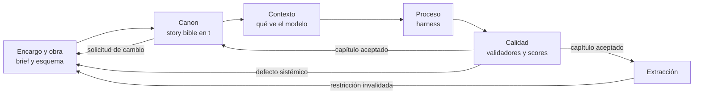

Hay tres retornos hacia el encargo: el defecto sistémico, que obliga a replanificar los capítulos pendientes; la invalidación de una restricción de destino, detectada al extraer; y la solicitud de cambio del lector sobre una novela ya publicada. Los tres terminan en el mismo sitio y por eso comparten flecha de destino.

## Entrevista y brief

La entrevista es el único punto donde entra información de fuera, y por eso es donde vive la desconfianza. Produce un brief validado con schema o no produce nada.

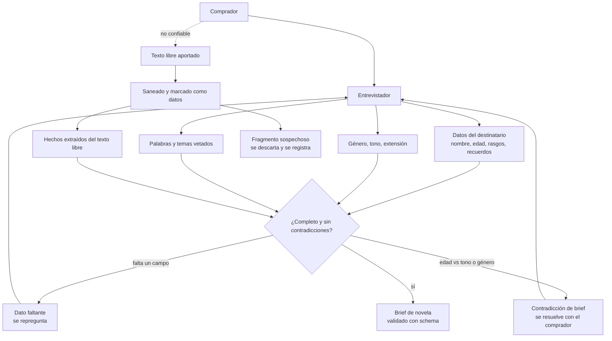

Las dos ramas de rechazo vuelven al entrevistador, no al planificador: un brief incompleto o contradictorio no entra en el ciclo de generación. El texto libre nunca alcanza el brief sin pasar por el saneado, y lo que en él parece una instrucción al sistema se registra y muere ahí.

## Árbol estructural de la obra

Jerarquía de contención pura. El capítulo es el nivel donde se genera, se valida y se hace checkpoint, y no hay nivel por debajo.

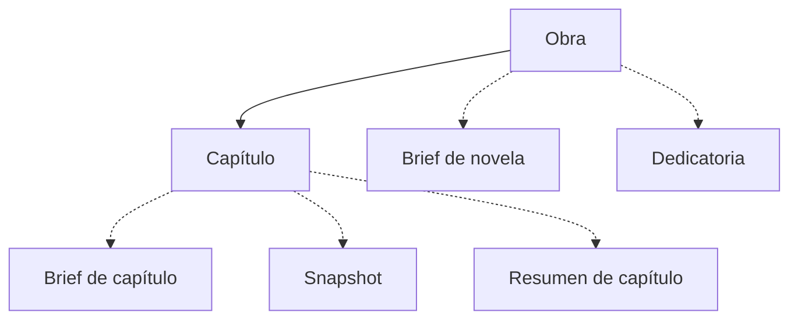

Las líneas discontinuas marcan lo que acompaña sin formar parte del texto: el encargo que lo origina, el estado del mundo que deja tras de sí y su versión comprimida para el contexto de los siguientes.

No hay acto ni escena. Un nivel intermedio sin estado, sin presupuesto y sin validador propios no se sostiene con el número de capítulos que declara `config/thresholds.yaml`: la función dramática que justificaría el acto es atributo del capítulo, y el grano fino de tiempo y lugar lo lleva el evento, que pertenece a la fábula y no a esta jerarquía.

## Árbol de entidades narrativas

Taxonomía de las clases sustantivas, en tres ramas. Se separan del árbol estructural porque atraviesan capítulos sin pertenecer a ninguno.

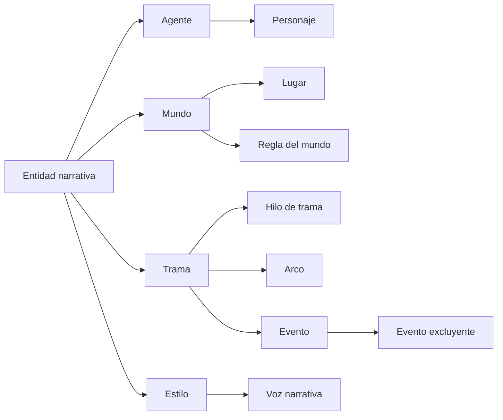

Personaje y Lugar son las dos entidades que la novela publica como ficha consultable, y de ahí que sean las dos con nombre propio en la rama de agente y de mundo. La regla del mundo ya no deriva de un punto de divergencia especulativa: su origen es el brief, y «el abuelo nunca aparece» es una regla tanto como lo sería la física de una novela de género.

**Anatomía del personaje**, la clase que más restricciones sostiene:

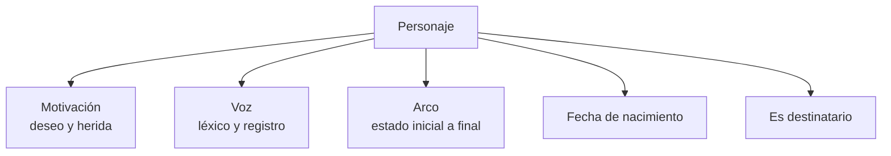

Las dos últimas ramas no son narrativas y por eso se dibujan: `fecha de nacimiento` es lo que permite demostrar que la edad de un personaje en cada evento cuadra, y `es destinatario` es lo que distingue al protagonista real de los demás para los validadores de reconocibilidad y de ortografía exacta del nombre.

## Grafo de entidades

Aquí las aristas son relaciones con semántica propia. El capítulo es el nodo central porque casi todas las relaciones del dominio pasan por él.

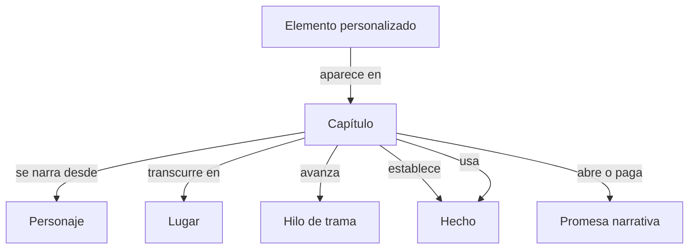

Las dos aristas entre capítulo y hecho son distintas y las dos hacen falta. `establece` es de dónde salió el hecho y hay una sola por hecho; `usa` es dónde se apoya el texto en él y hay tantas como capítulos lo mencionen. La regeneración dirigida se calcula con la segunda: si el perro pasa a llamarse Nala, hay que reescribir todo lo que *usa* el hecho, no solo el capítulo que lo *estableció*.

`Elemento personalizado aparece en Capítulo` es la arista que convierte «que se note que es para él» en una consulta con respuesta.

## Fábula y discurso

Dos ordenaciones del mismo material. Los eventos ocurren en un orden cronológico; los capítulos los narran en otro.

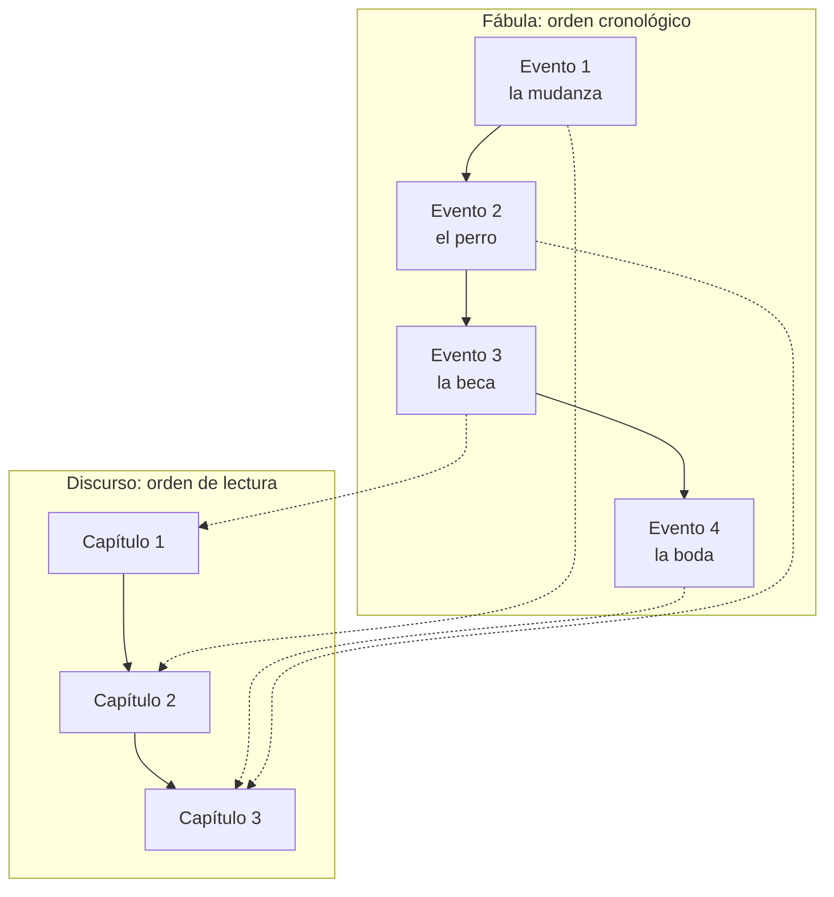

Un capítulo puede narrar varios eventos y un evento puede narrarse en varios capítulos o en ninguno. Esta relación N:M es lo que permite modelar analepsis y elipsis, y es además la razón de que la verificación de cronología lea de la fábula y no del orden de los capítulos: comprobar que el capítulo 3 va después del 2 no dice nada sobre cuándo ocurrieron los hechos que narran.

## Modelo de canon

El canon no se almacena como texto: se deriva de los capítulos aceptados y se proyecta en snapshots consultables.

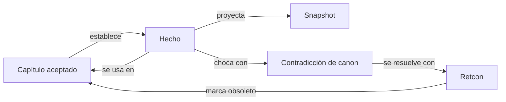

El ciclo contradicción → retcon → invalidación es lo que mantiene el canon coherente a lo largo de la novela; sin él los errores se acumulan en silencio. Es además el mismo mecanismo que atiende la solicitud de cambio del lector: un retcon pedido desde fuera y un retcon nacido de una contradicción recorren el mismo camino.

**Ciclo de vida de un hecho:**

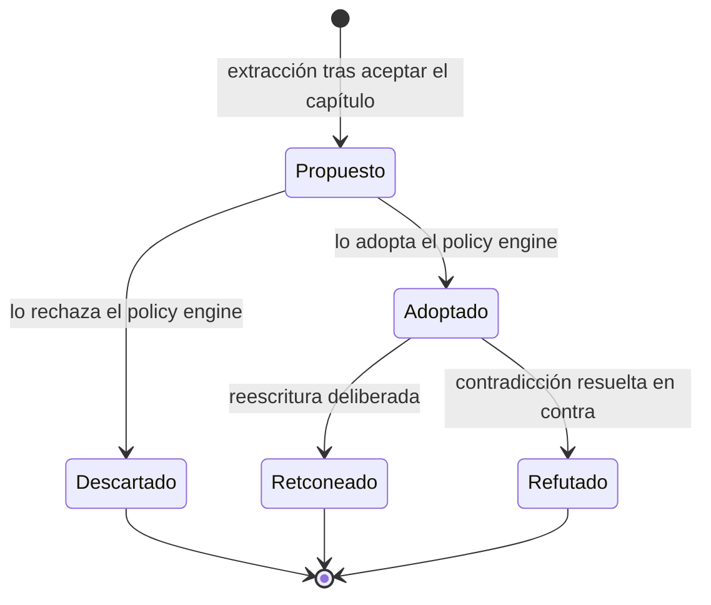

Quien mueve `Propuesto` a `Adoptado` es el policy engine y la decisión queda en el audit log. Un hecho `Propuesto` no es canon: no se consulta, no entra en el contexto del capítulo siguiente y no sostiene ninguna verificación. **Los tres estados de salida son terminales.** `Descartado` y `Refutado` lo eran ya; `Retconeado` lo es desde que la story bible se versiona por vigencia: el retcon **cierra** el hecho viejo con su `versión hasta` y **abre otro**, que es una fila distinta, no el mismo hecho revivido. La relación entre ambos la guarda `Retcon`. Resucitarlo destruiría lo único que el canon garantiza, que lo que fue verdad en `t` siga siendo consultable en `t`.

**El estatus describe la versión vigente, no la historia**, y de ahí sale la regla que más fácil es incumplir: **una consulta por versión se resuelve con la vigencia, nunca con el estatus**. En la versión anterior, un hecho que hoy está `Retconeado` seguía siendo verdad, y filtrar por estatus lo dejaría fuera.

**Ciclo de vida de una promesa narrativa:**

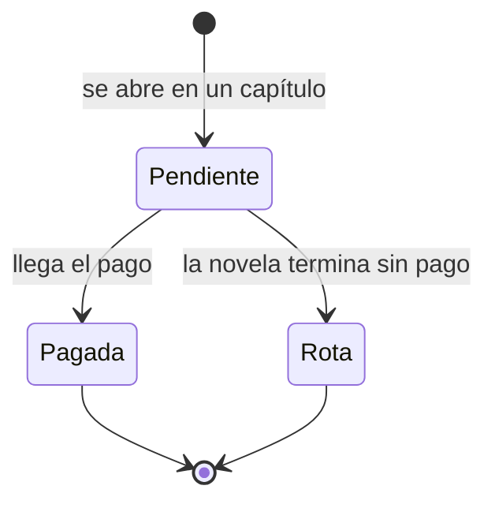

El recuento de promesas en `Pendiente` al llegar al último capítulo es exactamente el validador de cierre del arco: una novela que termina con promesas abiertas es una novela con final abrupto, y esa es una de las dos cosas que el comprador no acepta.

## Story bible

Modelo conceptual de la persistencia. No es el esquema SQL, pero el esquema se deriva de aquí sin decidir nada; la correspondencia clase a tabla vive en el documento de definiciones.

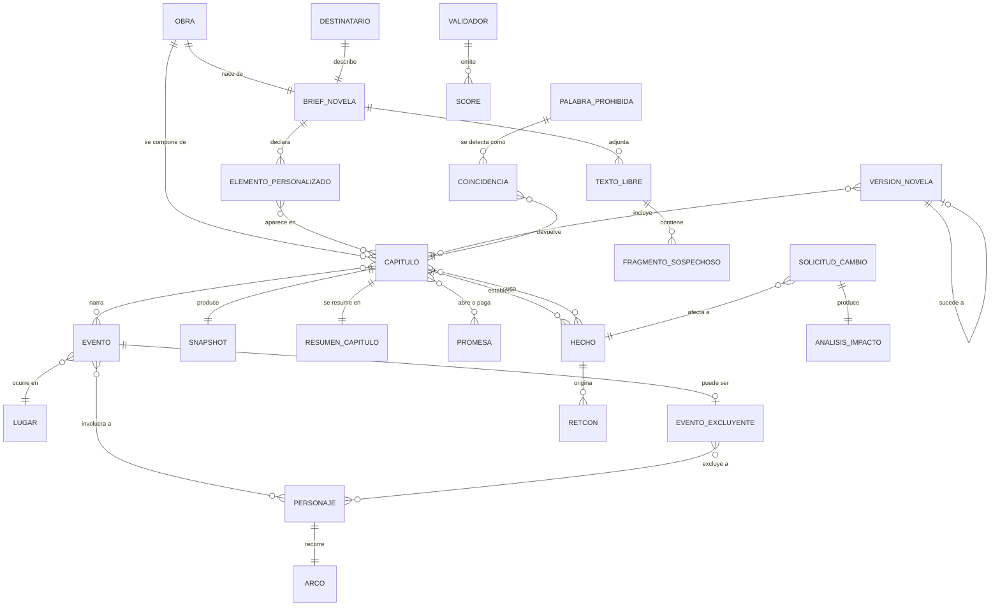

Tres puentes cargan con casi todo el peso del sistema. `CAPITULO }o--o{ HECHO : usa` es el que hace posible el análisis de impacto. `EVENTO }o--o{ PERSONAJE` junto con `EVENTO }o--|| LUGAR` es lo que se exporta a la verificación formal de la cronología. `VERSION_NOVELA }o--o{ CAPITULO` lleva la marca de capítulo modificado y es lo que permite decir qué cambió entre dos versiones sin diferenciar el texto.

## Ensamblado del contexto

Siete capas confluyen en el prompt de un capítulo, cada una con su fuente y su presupuesto.

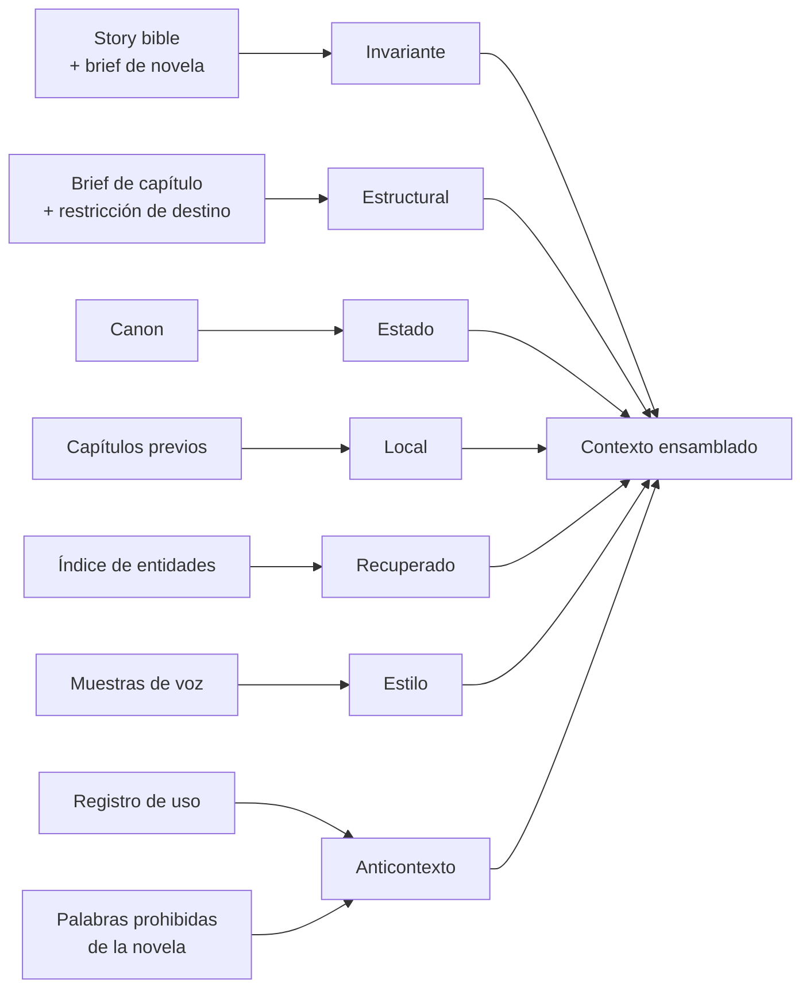

Las palabras prohibidas entran por el anticontexto y no solo por el guardrail: es más barato que el modelo no las escriba que rechazar el capítulo y reescribirlo, y el límite de reescrituras es finito.

La recuperación se filtra por las entidades declaradas en el brief de capítulo y solo después ordena por similitud: la similitud sola devuelve fragmentos de tono parecido y estado irrelevante.

**Jerarquía de compresión**, en tres niveles:

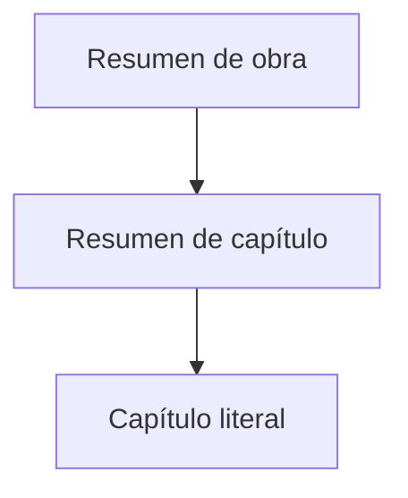

Lo lejano entra comprimido y lo cercano literal. El estado se pasa siempre como snapshot derivado, nunca como el texto completo de lo anterior.

## Mapa de validadores

Cada validador tiene un punto de ejecución y un nombre de score. El diagrama es el orden real: un capítulo los atraviesa de izquierda a derecha y no alcanza el gate si no ha pasado los hooks.

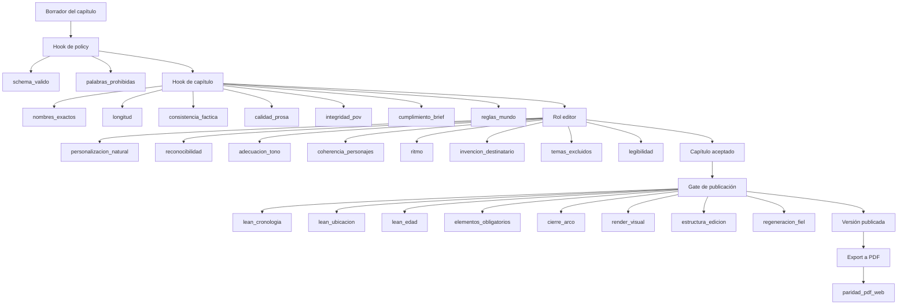

Los dos hooks y el rol editor operan sobre **un** capítulo; el gate opera sobre la **novela entera** y por eso es donde viven las tres demostraciones formales de la cronología, la cobertura de elementos obligatorios y el cierre del arco: ninguna de las cinco se puede decidir mirando un capítulo aislado.

Cada validador deja su resultado como score en la traza de la generación. El comprobador de modelos del harness no aparece en este diagrama porque no corre aquí: corre en desarrollo, no en cada generación.

**Ruta de un defecto**, que determina el coste de la corrección:

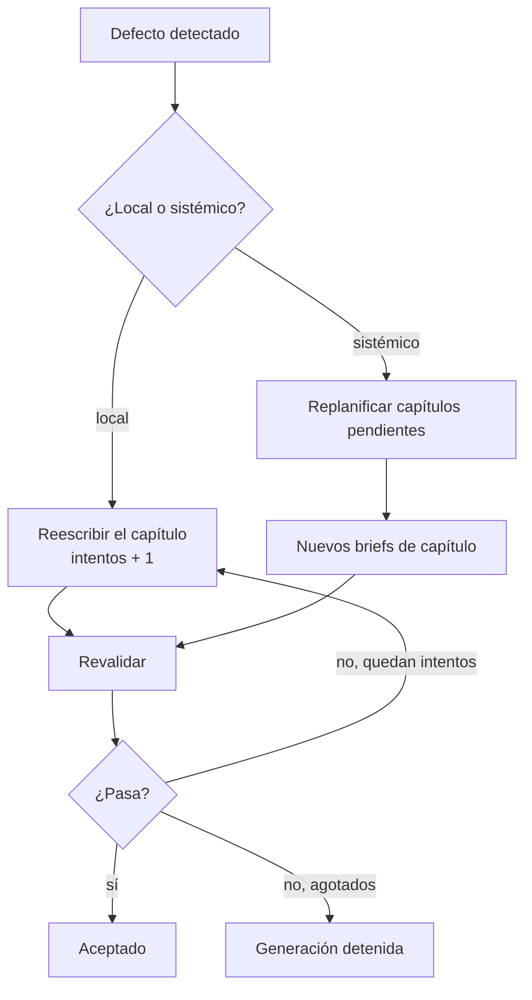

## Ciclo de producción

El canon solo se actualiza al aceptar un capítulo. Ese es el punto donde el sistema decide qué pasa a ser verdad en la novela.

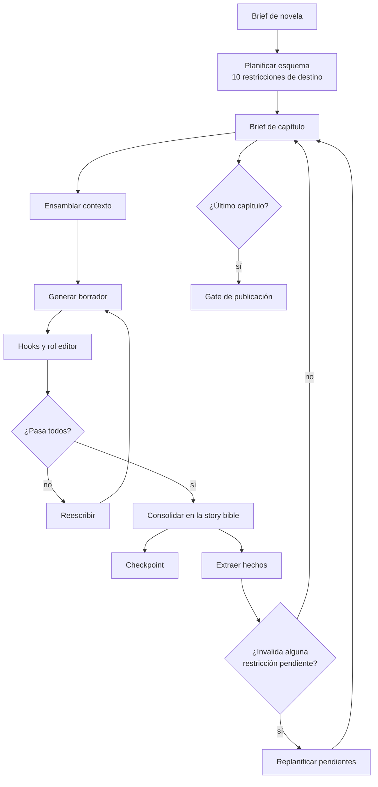

**Secuencia de un capítulo entre roles:**

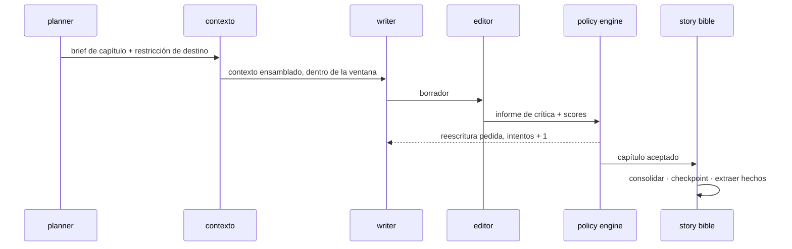

Quien acepta es el policy engine, no una persona, y cada una de sus decisiones queda en el audit log. Es el puesto que antes ocupaba el autor humano: la generación es automática de principio a fin, y el único humano que vuelve a entrar lo hace después de publicar.

## Estados

Las máquinas del capítulo y de la novela son las de la especificación formal del harness, una a una; la de la versión, también, como variable de estado del mismo módulo. Ningún estado intermedio se añade en el código sin actualizar antes este diagrama.

**Capítulo:**

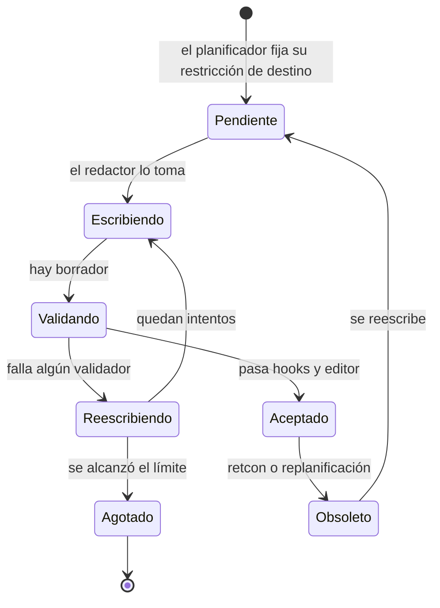

Solo la transición a `Aceptado` escribe en el canon. Un borrador rechazado no deja rastro; si lo dejara, cada iteración fallida contaminaría el estado del mundo y la regeneración dirigida acabaría propagando hechos que nunca llegaron a la novela.

`Agotado` es terminal y arrastra a la novela entera a `Detenida`: un capítulo que no converge no se salta.

**Novela:**

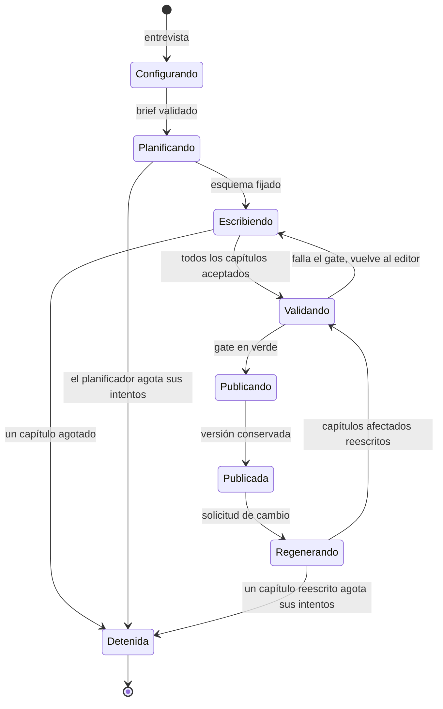

**Versión de novela:**

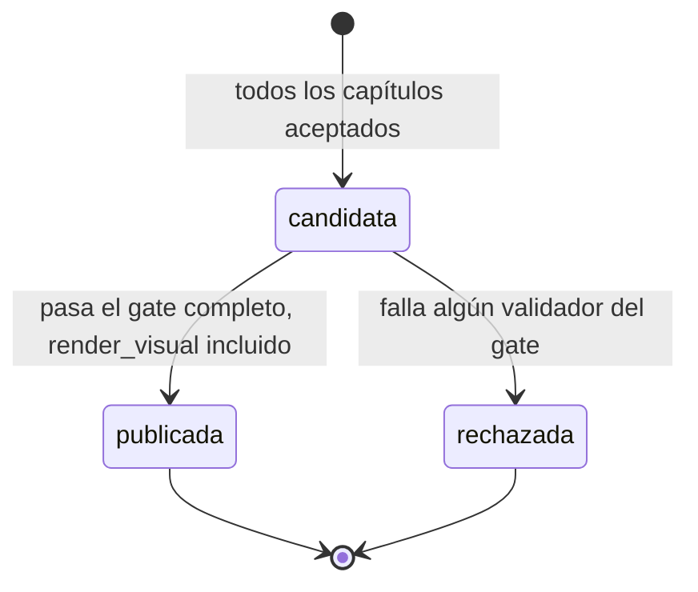

Una versión existe antes de publicarse porque `render_visual` tiene que pintarla: la lectura la pide por su número, y el gate la valida en el mismo render que después se entrega. Las dos salidas son terminales: una `publicada` es inmutable, y una `rechazada` se conserva para el diagnóstico pero **nunca es la versión vigente**, ni aparece en el listado del lector ni se exporta. La máquina es de `versioning/` y no del orquestador: la novela solo ve `Publicar` cuando la versión ya pasó.

`Publicada` no es terminal: una novela publicada sigue viva mientras el lector pueda pedir cambios. Lo que sí es invariante es que salir de `Publicada` nunca destruye la versión anterior, y que la única entrada a `Publicando` pasa por el gate.

## Solicitud de cambio

Lo que ocurre cuando el lector dice «el perro se llama Nala». Es el flujo que justifica que cada hecho registre en qué capítulos se usa.

```mermaid
flowchart TD
  LEC[Lector] --> SC[Solicitud de cambio]
  SC --> HEC[Hecho afectado]
  HEC --> AI[Análisis de impacto<br/>capítulos que USAN el hecho]
  AI --> RT[Retcon<br/>marca obsoletos los afectados]
  RT --> RG[Regeneración dirigida<br/>solo esos capítulos]
  RG --> HOK[Hooks y rol editor]
  HOK --> GT[Gate de publicación]
  GT -->|falla| RCH[Versión candidata rechazada<br/>la anterior sigue vigente]
  GT -->|pasa| NV[Versión de novela nueva]
  NV --> MRC[Marca de capítulo modificado]
  NV --> EXP[Export a PDF<br/>mismo render que la lectura]
  ANT[Versión anterior] -.->|se conserva siempre| NV
```

Tres cosas que el diagrama fija y no son negociables. **Una**, el análisis de impacto se calcula sobre `usa`, no sobre `establece`: un hecho establecido en el capítulo 2 y mencionado en el 7 obliga a reescribir los dos. **Dos**, la versión regenerada vuelve a pasar el gate completo, incluidas las tres demostraciones de cronología: cambiar un nombre no puede colarse sin verificar. **Tres**, la versión anterior se conserva siempre, porque un cambio pedido por el lector que empeora el resultado tiene que tener marcha atrás.

**La lectura es web y el PDF es un export de ella**, del mismo render. Por eso el diagrama no tiene una caja de novedades: qué capítulos cambiaron ya lo lleva la marca del vínculo entre versión y capítulo, y presentarlo al abrir el export es maquetación, no una clase del dominio. La solicitud llega siempre desde la propia página.

## Observabilidad

Jerarquía de lo que se consulta a posteriori. Una novela es una sesión, y todo lo que le ocurre cuelga de ahí.

```mermaid
flowchart TD
  SES[Sesión<br/>una por novela] --> T1[Traza · generación inicial]
  SES --> T2[Traza · regeneración]
  T1 --> S1[Span · interviewer]
  T1 --> S2[Span · planner]
  T1 --> S3[Span · writer]
  T1 --> S4[Span · editor]
  T1 --> S5[Span · extractor]
  S3 --> VP[Versión de prompt]
  T1 --> SC1[Score · consistencia_factica]
  T1 --> SC2[Score · palabras_prohibidas]
  T1 --> SC3[Score · lean_cronologia]
  S1 --> TK[Tokens · coste · latencia]
  S3 --> TK
```

La sesión agrupa la entrevista, la generación y todas las regeneraciones posteriores: sin eso, el coste de una novela quedaría repartido entre trazas sin nadie que las sume. Los scores cuelgan de la traza y no del span porque un validador puede leer varios capítulos —el cierre del arco los lee todos— y no pertenece a ninguno.

Cada capítulo puede decir con qué versión de prompt se generó, que es lo que permite que una iteración de tuning enseñe qué cambió y qué efecto tuvo.
