# Conocimiento de dominio — Árboles y grafos de la ontología

2026-09-21 · @Bruno Cruz

Representación visual de la ontología definida en el documento de definiciones: jerarquías de clases, grafo de relaciones, flujos de contexto y máquina de estados de producción. Cada diagrama es un bloque Mermaid editable.

## Mapa de capas

Las cinco capas forman un ciclo cerrado: la obra se planifica, el canon fija lo verdadero, el contexto alimenta la generación, la calidad decide si se acepta y el proceso devuelve el resultado al canon.

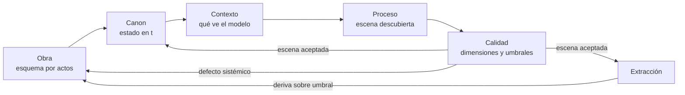
```mermaid
flowchart LR
  OBRA[Obra<br/>esquema por actos] --> CANON[Canon<br/>estado en t]
  CANON --> CTX[Contexto<br/>qué ve el modelo]
  CTX --> PRC[Proceso<br/>escena descubierta]
  PRC --> CAL[Calidad<br/>dimensiones y umbrales]
  CAL -->|escena aceptada| CANON
  CAL -->|escena aceptada| EXT[Extracción]
  CAL -->|defecto sistémico| OBRA
  EXT -->|deriva sobre umbral| OBRA
```

Hay dos retornos hacia la obra: el defecto sistémico, que obliga a replanificar de inmediato, y el acumulado de hallazgos, que dispara la replanificación rodante cuando la deriva supera el umbral.

## Modo híbrido

Se planifica por arriba y se descubre por abajo. La frontera entre ambos regímenes cae entre el capítulo y la escena.

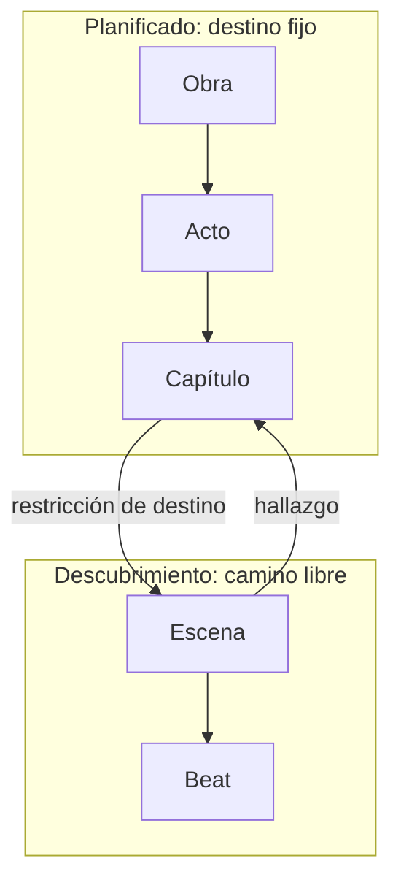
```mermaid
flowchart TD
  subgraph PLAN[Planificado: destino fijo]
    O[Obra] --> A[Acto]
    A --> C[Capítulo]
  end
  subgraph DESC[Descubrimiento: camino libre]
    E[Escena] --> B[Beat]
  end
  C -->|restricción de destino| E
  E -->|hallazgo| C
```

La flecha descendente lleva restricciones: qué debe ser cierto al terminar la escena. La ascendente lleva hallazgos: lo que surgió al escribirla y el plan no había previsto.

**Los dos bucles de producción**, con cadencias distintas:

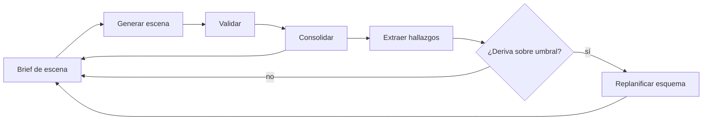
```mermaid
flowchart LR
  BRF[Brief de escena] --> GEN[Generar escena]
  GEN --> VAL[Validar]
  VAL --> CSL[Consolidar]
  CSL --> BRF
  CSL --> EXT[Extraer hallazgos]
  EXT --> DRV{¿Deriva sobre umbral?}
  DRV -->|no| BRF
  DRV -->|sí| RPL[Replanificar esquema]
  RPL --> BRF
```

El bucle corto gira en cada escena; el largo solo cuando la deriva lo justifica. Replanificar en cada escena disuelve la estructura; no hacerlo nunca deja un esquema que ya no describe la obra.

**Ciclo de vida de un hallazgo:**

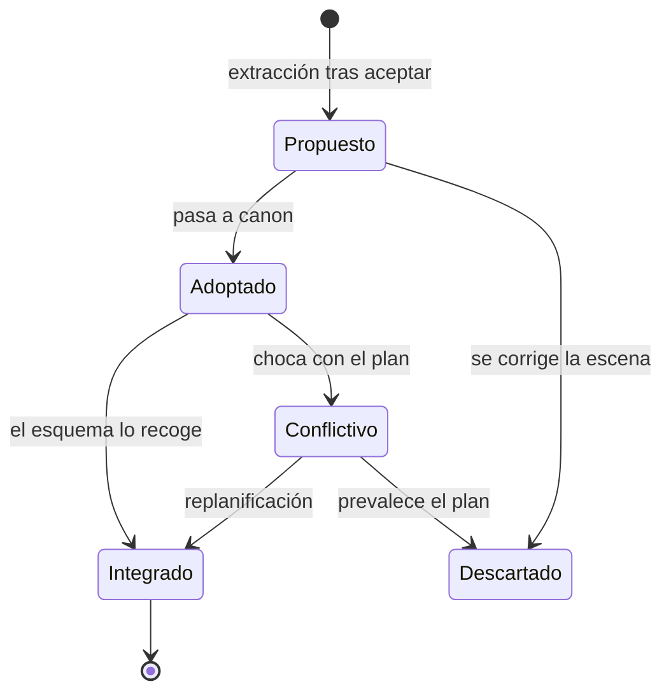
```mermaid
stateDiagram-v2
  [*] --> Propuesto: extracción tras aceptar
  Propuesto --> Adoptado: pasa a canon
  Propuesto --> Descartado: se corrige la escena
  Adoptado --> Integrado: el esquema lo recoge
  Adoptado --> Conflictivo: choca con el plan
  Conflictivo --> Integrado: replanificación
  Conflictivo --> Descartado: prevalece el plan
  Integrado --> [*]
```

El estado `Conflictivo` es el punto de decisión del método: ahí se elige entre defender el plan o dejar que la novela cambie de rumbo.

## Árbol estructural de la obra

Jerarquía de contención pura: cada nivel agrupa al siguiente y la escena es el nivel donde se genera y se valida.

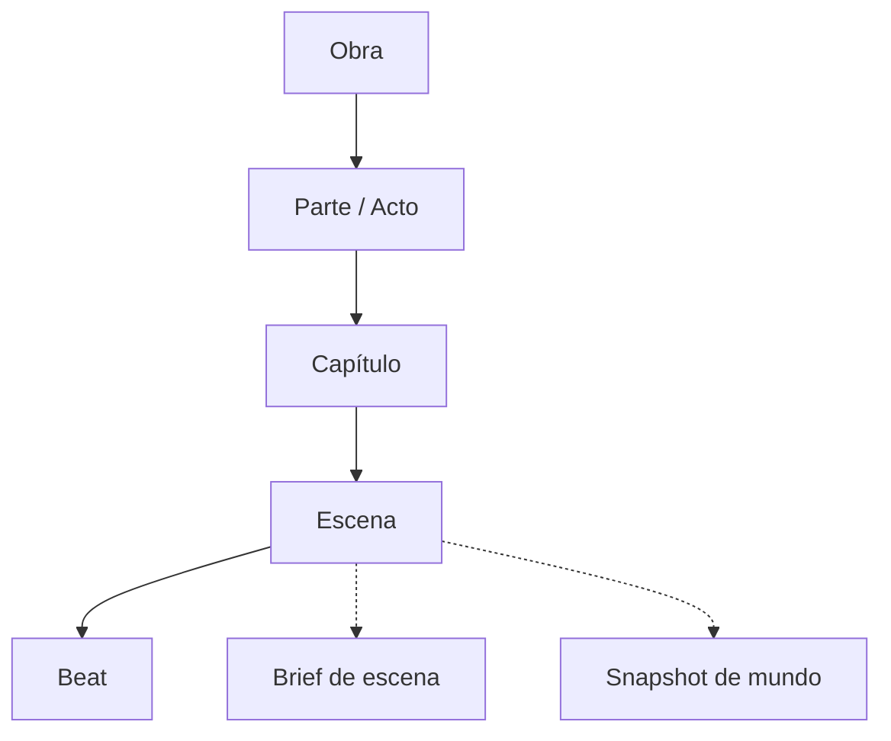
```mermaid
flowchart TD
  O[Obra] --> P[Parte / Acto]
  P --> C[Capítulo]
  C --> E[Escena]
  E --> B[Beat]
  E -.-> BR[Brief de escena]
  E -.-> SN[Snapshot de mundo]
```

Las líneas discontinuas marcan lo que acompaña a la escena sin formar parte del texto: el encargo que la origina y el estado del mundo que deja tras de sí.

## Árbol de entidades narrativas

Taxonomía de las clases sustantivas, en tres ramas. Se separan del árbol estructural porque atraviesan capítulos y escenas sin pertenecer a ninguno.

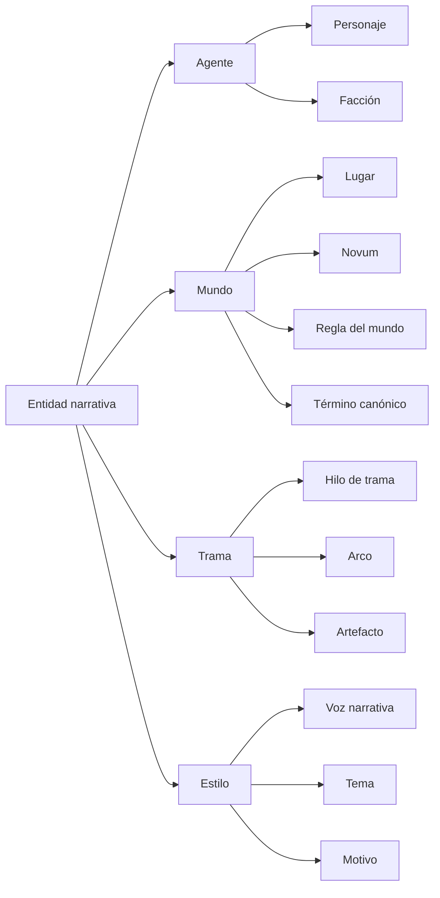
```mermaid
flowchart LR
  EN[Entidad narrativa] --> AG[Agente]
  EN --> MU[Mundo]
  EN --> TR[Trama]
  EN --> ES[Estilo]
  AG --> PJ[Personaje]
  AG --> FA[Facción]
  MU --> LU[Lugar]
  MU --> NO[Novum]
  MU --> RG[Regla del mundo]
  MU --> TC[Término canónico]
  TR --> HI[Hilo de trama]
  TR --> AR[Arco]
  TR --> AT[Artefacto]
  ES --> VN[Voz narrativa]
  ES --> TM[Tema]
  ES --> MT[Motivo]
```

La rama de mundo es la que más crece en ciencia ficción: el novum genera reglas, las reglas generan términos y los términos exigen un glosario canónico que el sistema debe respetar en cada escena.

**Anatomía del personaje**, la clase más compleja:

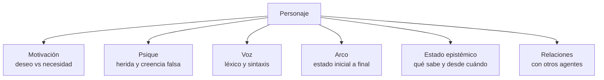
```mermaid
flowchart TD
  PJ[Personaje] --> MO[Motivación<br/>deseo vs necesidad]
  PJ --> PS[Psique<br/>herida y creencia falsa]
  PJ --> VZ[Voz<br/>léxico y sintaxis]
  PJ --> AR[Arco<br/>estado inicial a final]
  PJ --> EP[Estado epistémico<br/>qué sabe y desde cuándo]
  PJ --> RL[Relaciones<br/>con otros agentes]
```

El estado epistémico es la rama que más fallos previene: sin ella el sistema escribe personajes que actúan sobre información que aún no han recibido.

## Grafo de entidades

A diferencia de los árboles anteriores, aquí las aristas son relaciones con semántica propia. La escena es el nodo central porque casi todas las relaciones del dominio pasan por ella.

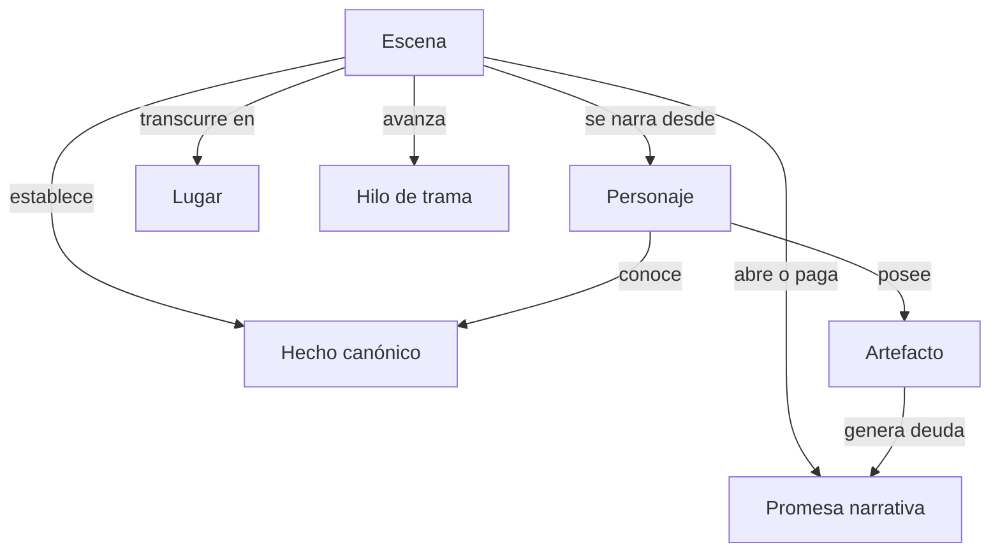
```mermaid
flowchart TD
  ESC[Escena]
  PJ[Personaje]
  LU[Lugar]
  HI[Hilo de trama]
  HC[Hecho canónico]
  PR[Promesa narrativa]
  AT[Artefacto]
  ESC -->|se narra desde| PJ
  ESC -->|transcurre en| LU
  ESC -->|avanza| HI
  ESC -->|establece| HC
  ESC -->|abre o paga| PR
  PJ -->|conoce| HC
  PJ -->|posee| AT
  AT -->|genera deuda| PR
```

La arista `Personaje conoce Hecho` es distinta de `Escena establece Hecho`: un hecho puede ser verdad en el mundo y desconocido para casi todos los personajes. De esa diferencia salen la ironía dramática y las revelaciones.

**Mundo especulativo**, donde el novum propaga consecuencias:

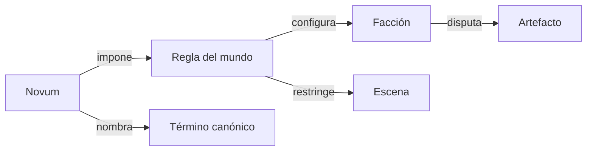
```mermaid
flowchart LR
  NO[Novum] -->|impone| RG[Regla del mundo]
  NO -->|nombra| TC[Término canónico]
  RG -->|configura| FA[Facción]
  FA -->|disputa| AT[Artefacto]
  RG -->|restringe| ESC[Escena]
```

Si una escena viola una regla derivada del novum, el defecto es sistémico: no se corrige reescribiendo la escena, sino revisando la regla o la planificación.

## Fábula y discurso

Dos ordenaciones del mismo material. Los eventos ocurren en un orden cronológico; las escenas los narran en otro.

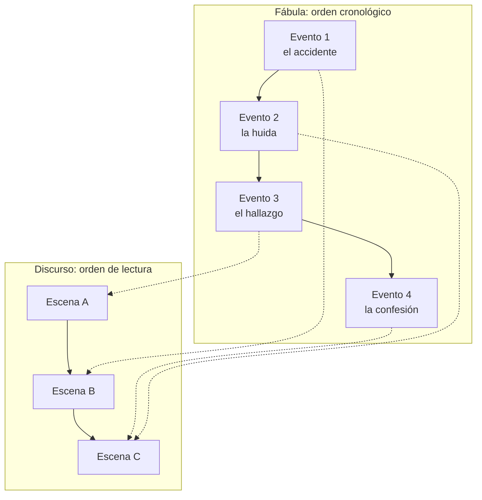
```mermaid
flowchart TD
  subgraph FAB[Fábula: orden cronológico]
    E1[Evento 1<br/>el accidente] --> E2[Evento 2<br/>la huida]
    E2 --> E3[Evento 3<br/>el hallazgo]
    E3 --> E4[Evento 4<br/>la confesión]
  end
  subgraph DIS[Discurso: orden de lectura]
    S1[Escena A] --> S2[Escena B]
    S2 --> S3[Escena C]
  end
  E3 -.-> S1
  E1 -.-> S2
  E4 -.-> S3
  E2 -.-> S3
```

Una escena puede narrar varios eventos y un evento puede narrarse en varias escenas o en ninguna. Esta relación N:M es lo que permite modelar analepsis, elipsis y revelaciones diferidas sin romper la consistencia temporal.

## Modelo de canon

El canon no se almacena como texto: se deriva de las escenas aceptadas y se proyecta en snapshots consultables.

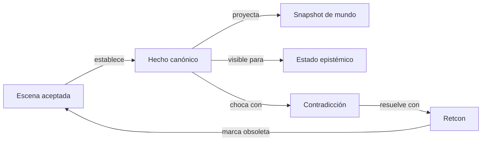
```mermaid
flowchart LR
  ESC[Escena aceptada] -->|establece| HC[Hecho canónico]
  HC -->|proyecta| SN[Snapshot de mundo]
  HC -->|visible para| EP[Estado epistémico]
  HC -->|choca con| CO[Contradicción]
  CO -->|resuelve con| RT[Retcon]
  RT -->|marca obsoleta| ESC
```

El ciclo contradicción → retcon → invalidación es lo que mantiene el canon coherente a lo largo de una novela entera; sin él los errores se acumulan en silencio.

**Ciclo de vida de un hecho canónico:**

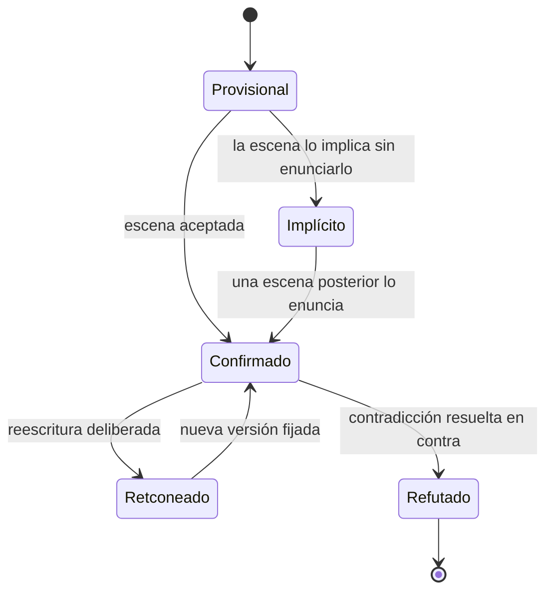
```mermaid
stateDiagram-v2
  [*] --> Provisional
  Provisional --> Confirmado: escena aceptada
  Provisional --> Implícito: la escena lo implica sin enunciarlo
  Implícito --> Confirmado: una escena posterior lo enuncia
  Confirmado --> Retconeado: reescritura deliberada
  Confirmado --> Refutado: contradicción resuelta en contra
  Retconeado --> Confirmado: nueva versión fijada
  Refutado --> [*]
```

**Ciclo de vida de una promesa narrativa:**

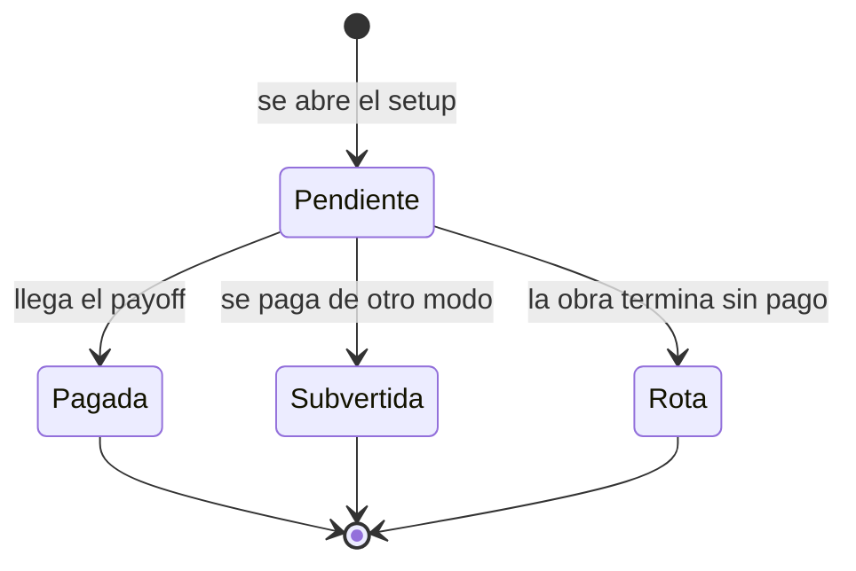
```mermaid
stateDiagram-v2
  [*] --> Pendiente: se abre el setup
  Pendiente --> Pagada: llega el payoff
  Pendiente --> Subvertida: se paga de otro modo
  Pendiente --> Rota: la obra termina sin pago
  Pagada --> [*]
  Subvertida --> [*]
  Rota --> [*]
```

El recuento de promesas en estado `Pendiente` frente a las escenas restantes es el mejor indicador temprano de que una novela se está desarmando.

## Ensamblado del contexto

Siete capas confluyen en el prompt de una escena, cada una con su fuente y su presupuesto.

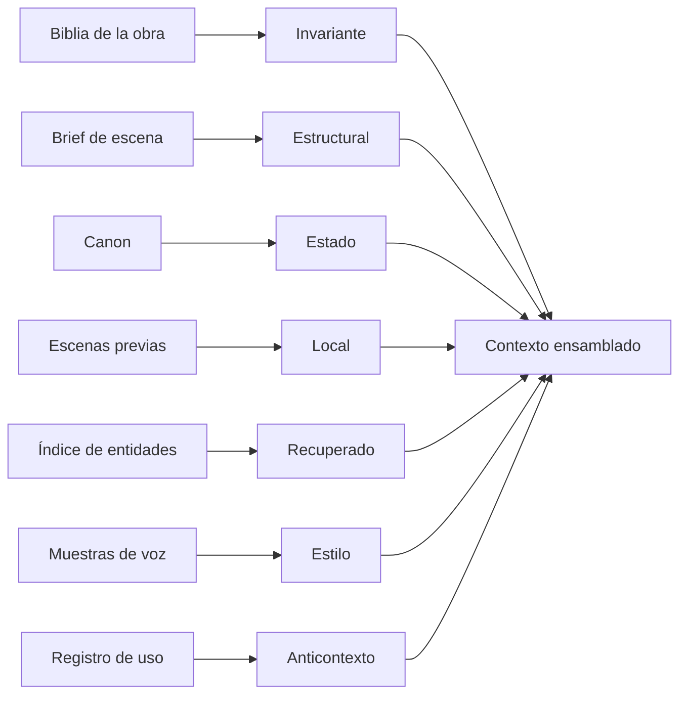
```mermaid
flowchart LR
  BIB[Biblia de la obra] --> INV[Invariante]
  BRF[Brief de escena] --> EST[Estructural]
  CAN[Canon] --> SNP[Estado]
  TXT[Escenas previas] --> LOC[Local]
  IDX[Índice de entidades] --> REC[Recuperado]
  VOZ[Muestras de voz] --> STY[Estilo]
  USO[Registro de uso] --> ANT[Anticontexto]
  INV --> CTX[Contexto ensamblado]
  EST --> CTX
  SNP --> CTX
  LOC --> CTX
  REC --> CTX
  STY --> CTX
  ANT --> CTX
```

La recuperación se filtra por las entidades declaradas en el brief, no por similitud semántica: esta última devuelve fragmentos de tono parecido pero de estado irrelevante.

**Jerarquía de compresión**, para ajustar el zoom según el presupuesto disponible:

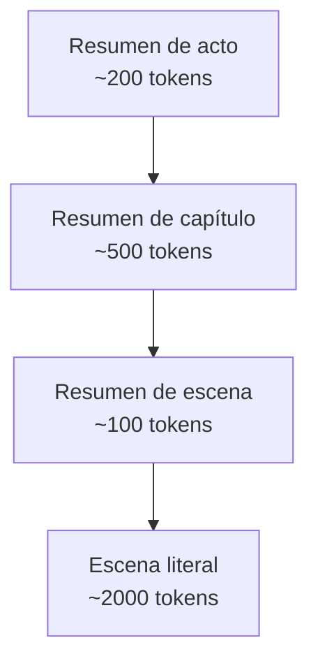
```mermaid
flowchart TD
  ACT[Resumen de acto<br/>~200 tokens] --> CAP[Resumen de capítulo<br/>~500 tokens]
  CAP --> RES[Resumen de escena<br/>~100 tokens]
  RES --> ESC[Escena literal<br/>~2000 tokens]
```

Lo lejano entra comprimido y lo cercano literal. La regla práctica: el estado se pasa como snapshot derivado, nunca como el texto completo de lo anterior.

## Árbol de calidad

Seis familias que agrupan las diecisiete dimensiones de la Capa 4, sin dejar ninguna fuera ni repetir ninguna. Cada hoja del árbol necesita definición, nivel de aplicación, método de medición y umbral.

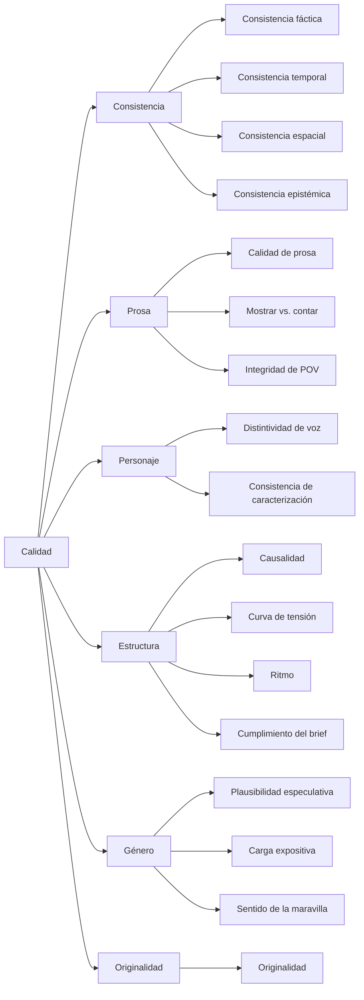
```mermaid
flowchart LR
  CAL[Calidad] --> CON[Consistencia]
  CAL --> PRO[Prosa]
  CAL --> PER[Personaje]
  CAL --> STR[Estructura]
  CAL --> GEN[Género]
  CAL --> ORI[Originalidad]
  CON --> C1[Consistencia fáctica]
  CON --> C2[Consistencia temporal]
  CON --> C3[Consistencia espacial]
  CON --> C4[Consistencia epistémica]
  PRO --> P1[Calidad de prosa]
  PRO --> P2[Mostrar vs. contar]
  PRO --> P3[Integridad de POV]
  PER --> R1[Distintividad de voz]
  PER --> R2[Consistencia de caracterización]
  STR --> S1[Causalidad]
  STR --> S2[Curva de tensión]
  STR --> S3[Ritmo]
  STR --> S4[Cumplimiento del brief]
  GEN --> G1[Plausibilidad especulativa]
  GEN --> G2[Carga expositiva]
  GEN --> G3[Sentido de la maravilla]
  ORI --> O1[Originalidad]
```

**Ruta de un defecto**, que determina el coste de la corrección:

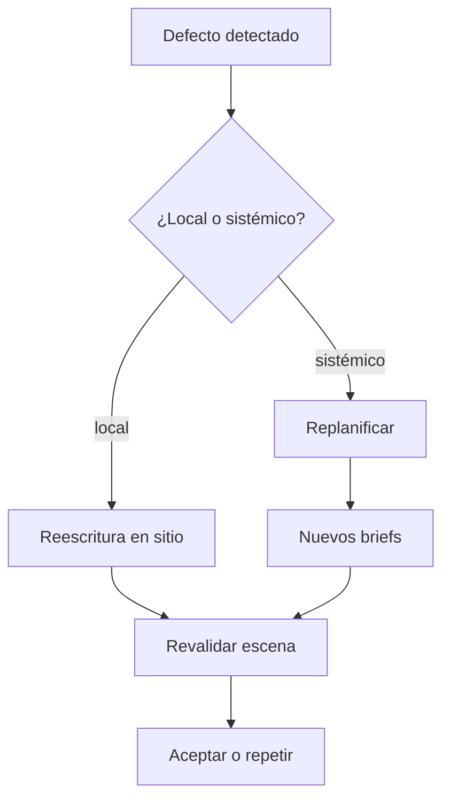
```mermaid
flowchart TD
  DEF[Defecto detectado] --> CLS{¿Local o sistémico?}
  CLS -->|local| EDI[Reescritura en sitio]
  CLS -->|sistémico| PLN[Replanificar]
  EDI --> VAL[Revalidar escena]
  PLN --> BRF[Nuevos briefs]
  BRF --> VAL
  VAL --> ACP[Aceptar o repetir]
```

La originalidad merece rama propia porque el fallo característico de un modelo no es escribir mal, sino escribir correcto y genérico; ninguna de las otras dimensiones lo detecta.

## Ciclo de producción

El canon solo se actualiza al consolidar. Ese es el punto donde el sistema decide qué pasa a ser verdad en la novela.

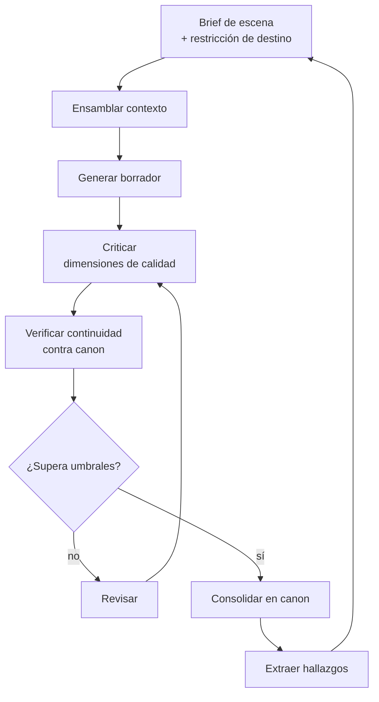
```mermaid
flowchart TD
  PLN[Brief de escena<br/>+ restricción de destino] --> CTX[Ensamblar contexto]
  CTX --> GEN[Generar borrador]
  GEN --> CRI[Criticar<br/>dimensiones de calidad]
  CRI --> VER[Verificar continuidad<br/>contra canon]
  VER --> DEC{¿Supera umbrales?}
  DEC -->|no| REV[Revisar]
  REV --> CRI
  DEC -->|sí| CSL[Consolidar en canon]
  CSL --> EXT[Extraer hallazgos]
  EXT --> PLN
```

**Estados de una escena:**

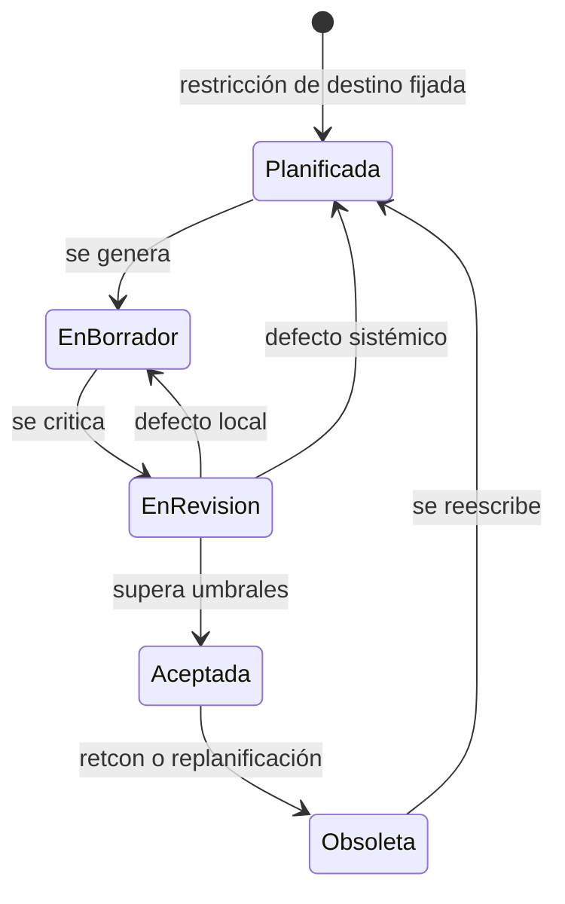
```mermaid
stateDiagram-v2
  [*] --> Planificada: restricción de destino fijada
  Planificada --> EnBorrador: se genera
  EnBorrador --> EnRevision: se critica
  EnRevision --> EnBorrador: defecto local
  EnRevision --> Planificada: defecto sistémico
  EnRevision --> Aceptada: supera umbrales
  Aceptada --> Obsoleta: retcon o replanificación
  Obsoleta --> Planificada: se reescribe
```

Solo la transición a `Aceptada` escribe en el canon. Un borrador rechazado no deja rastro; si lo dejara, cada iteración fallida contaminaría el estado del mundo.

**Secuencia de una escena entre roles:**

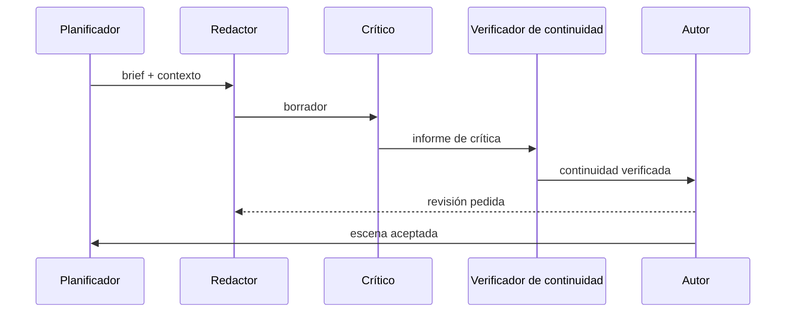
```mermaid
sequenceDiagram
  participant P as Planificador
  participant R as Redactor
  participant C as Crítico
  participant V as Verificador de continuidad
  participant A as Autor
  P->>R: brief + contexto
  R->>C: borrador
  C->>V: informe de crítica
  V->>A: continuidad verificada
  A-->>R: revisión pedida
  A->>P: escena aceptada
```

El autor humano mantiene la última decisión: define el gusto, acepta y marca dirección. Los demás roles pueden ser modelos, pero ese no.

El autor humano decide además qué hallazgos se adoptan: es donde el método híbrido concentra el juicio que ningún modelo puede sustituir, porque adoptar un hallazgo equivale a cambiar la novela que se está escribiendo.
